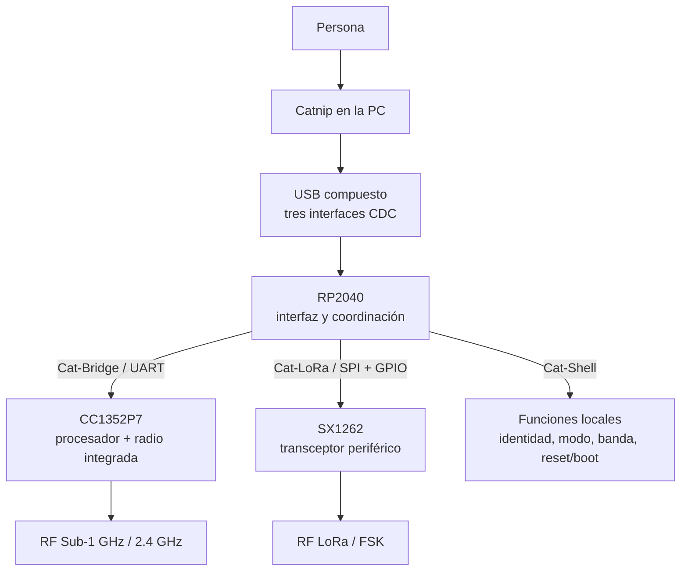
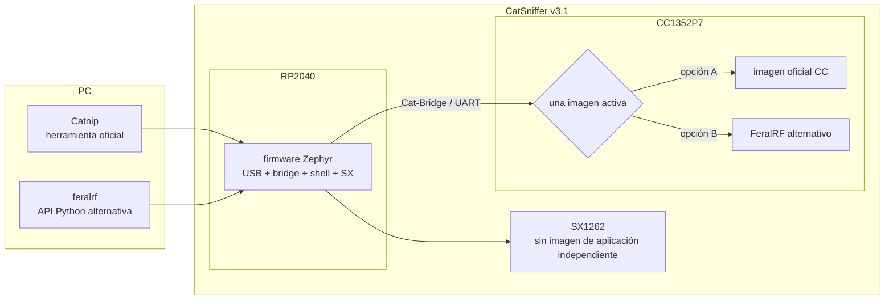

# CatSniffer — Mapa conceptual del sistema

## En una frase

CatSniffer v3.1 es una plataforma de radio con **dos procesadores programables y un transceptor externo**, conectada a la PC mediante un RP2040 que organiza varios caminos de comunicación.

> [!tip] Cómo usar este mapa
> Empieza aquí, sigue [[Ruta de estudio - De CatSniffer a FeralRF]] y vuelve a este diagrama cuando un detalle parezca aislado. Los enlaces llevan de la intuición a las notas técnicas y, finalmente, a las fuentes.

## Modelo mental

Piensa en CatSniffer como un pequeño sistema distribuido dentro de una sola placa:

- la **PC** ejecuta herramientas de usuario, principalmente [[Catnip CLI|Catnip]];
- el [[RP2040 - El procesador de interfaz|RP2040]] es la recepción y el distribuidor: termina USB, atiende comandos locales y dirige tráfico hacia otros subsistemas;
- el [[CC1352P7 - El procesador de radio programable|CC1352P7]] es otro computador, con su propia memoria, firmware y radio integrada;
- el [[SX1262 - El transceptor controlado por RP2040|SX1262]] es un radio periférico: recibe órdenes del RP2040, pero no ejecuta una imagen de aplicación separada del proyecto.

Esto explica por qué “el firmware de CatSniffer” no es una sola cosa. Hay una imagen para RP2040 y otra para CC1352P7; el SX1262 se configura mediante comandos durante la ejecución.

## El sistema completo

La palabra **CDC** significa aquí *USB Communications Device Class*: cada CDC se presenta a la PC como una interfaz serie virtual. No son tres conectores físicos; son tres funciones lógicas dentro del mismo enlace USB. Véase [[USB CDC - Cómo CatSniffer aparece ante la PC]].

## Relaciones que organizan el Vault

### Hardware

[[Arquitectura CatSniffer v3.1]] contiene la evidencia de placa. Para aprender primero las responsabilidades, usa [[RP2040, CC1352P7 y SX1262 - Quién hace qué]].

### Firmware oficial

[[Mapa de firmware oficial]] explica qué imagen corre en cada procesador. Después profundiza con [[Firmware RP2040]] y [[Firmware CC1352P7]].

### Interfaces con la PC

[[Protocolos host-dispositivo]] compara [[USB CDC - Cómo CatSniffer aparece ante la PC|Cat-Bridge, Cat-LoRa y Cat-Shell]]. [[Del PC a la radio - Rutas de extremo a extremo]] muestra cómo viajan comandos y datos completos.

### Herramientas

[[Mapa de herramientas y comunicación PC]] coloca a [[Catnip CLI|Catnip]] en el sistema: Catnip es software de la PC, no firmware. Descubre las interfaces, envía comandos, recibe capturas y coordina actualización de firmware.

### FeralRF

[[Arquitectura FeralRF|FeralRF]] cambia específicamente la imagen que ejecuta el CC1352P7. Conserva la placa, el RP2040 y Cat-Bridge; no usa SX1262. [[Matriz de capacidades]] separa lo anunciado, implementado, probado y físicamente reportado.

## Mapa de propiedad del software

“Firmware image” o **imagen de firmware** significa un archivo compilado que se graba en la memoria de un procesador para que éste lo ejecute. “Flashing” es ese acto de grabación. Que FeralRF reemplace una imagen del CC1352P7 no implica que sustituya la imagen del RP2040.

## Ideas que deben quedar claras

1. CatSniffer es una placa, no una sola aplicación.
2. RP2040 y CC1352P7 son computadores independientes que ejecutan imágenes diferentes.
3. SX1262 es un transceptor controlado por RP2040, no un tercer MCU de aplicación.
4. USB llega físicamente al RP2040; éste expone tres CDC con destinos distintos.
5. Catnip corre en la PC y utiliza esas rutas; no corre dentro de la placa.
6. FeralRF corre en CC1352P7 y reutiliza Cat-Bridge/RP2040.

## Concepciones erróneas comunes

- **“CatSniffer tiene un solo firmware.”** No: RP2040 y CC1352P7 tienen imágenes separadas.
- **“Catnip es firmware.”** No: es software host, es decir, software que corre en la PC.
- **“Cat-Bridge, Cat-LoRa y Cat-Shell son tres puertos USB físicos.”** No: son interfaces CDC lógicas del mismo USB.
- **“Todos los radios son controlados por el mismo procesador.”** No: CC1352P7 gobierna su radio integrada; RP2040 gobierna SX1262.
- **“FeralRF reemplaza todo CatSniffer.”** No: sustituye el firmware CC y conserva la infraestructura RP2040/USB.

## Por qué esto importa después

Toda lectura de código, actualización de firmware o prueba futura depende de identificar correctamente el **host** (PC que inicia la operación), el **target** (procesador al que se dirige), la interfaz usada y quién interpreta el mensaje. Confundir esas fronteras lleva a buscar comandos en el procesador equivocado o a atribuir a FeralRF funciones del SX1262.

## Comprueba tu comprensión

1. ¿Por qué CatSniffer necesita dos imágenes de firmware aunque tenga un solo conector USB?
2. ¿Qué diferencia conceptual hay entre CC1352P7 y SX1262?
3. ¿Qué componente ve físicamente el USB de la PC?
4. ¿Qué permanece igual cuando se instala FeralRF?
5. ¿Por qué Cat-Bridge puede transportar protocolos diferentes sin comprenderlos?

**Siguiente:** [[Ruta de estudio - De CatSniffer a FeralRF]]
