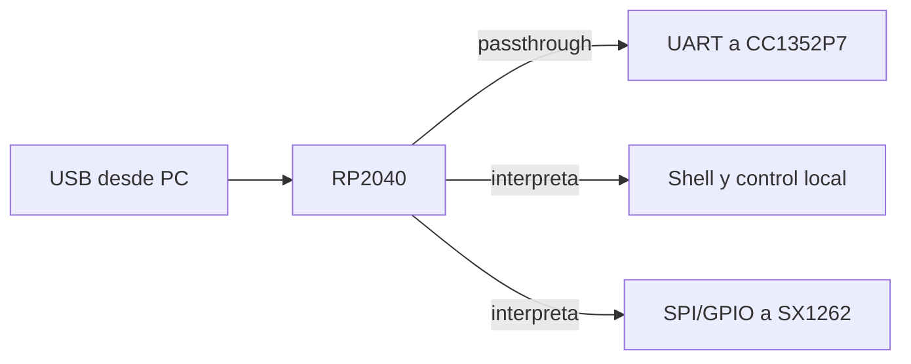

# RP2040 — El procesador de interfaz

## En una frase

El RP2040 es el punto de entrada USB de CatSniffer y el componente que distribuye tráfico hacia CC1352P7, SX1262 o su propia shell.

## Modelo mental

Para la PC, el RP2040 es “la placa”. El cable USB termina en él. Sin embargo, no ejecuta toda la lógica de radio: actúa como una central con tres ventanillas, [[Protocolos host-dispositivo|Cat-Bridge, Cat-LoRa y Cat-Shell]].

Un **bridge** o puente transporta información entre dos enlaces. En Cat-Bridge, RP2040 mueve bytes entre USB CDC y UART sin adjudicarse normalmente la semántica de los comandos destinados al CC1352P7.

## Qué hace realmente

- ejecuta firmware Zephyr desde su propia flash;
- expone un dispositivo USB compuesto con tres CDC;
- puentea Cat-Bridge a la UART del CC1352P7;
- interpreta Cat-Shell y controla identidad, modo, banda, boot/reset y otras funciones locales;
- interpreta/controla la ruta Cat-LoRa y opera SX1262 mediante SPI y GPIO;
- controla señales de placa como `CTF1..3` y LEDs.

## Interfaces en contexto

- **USB CDC:** puerto serie virtual visible por la PC.
- **UART:** transmisión serie asíncrona entre RP2040 y CC1352P7.
- **SPI:** reloj y datos síncronos con chip-select para ordenar al SX1262.
- **GPIO:** pines digitales usados como señales individuales, por ejemplo reset, busy, interrupción o selección RF.

## Qué firmware lo controla

La imagen oficial reside en `CatSniffer-Firmware/RP2040/catsniffer/` y usa Zephyr, west y CMake. [[Firmware RP2040]] explica startup, callbacks, buffers y comandos. [[Mapa de firmware oficial]] explica cómo esta imagen convive con la imagen independiente del CC.

## Lo que RP2040 no hace

- No ejecuta Catnip: Catnip corre en la PC.
- No ejecuta FeralRF: FeralRF corre en CC1352P7.
- No interpreta normalmente el protocolo runtime que cruza Cat-Bridge hacia el CC.
- No convierte SX1262 en un procesador: simplemente lo controla como periférico.

## Por qué esto importa después

FeralRF depende de que este procesador siga ofreciendo Cat-Bridge. Por eso reemplazar el firmware CC no reemplaza la infraestructura USB. También explica por qué seleccionar correctamente una banda externa puede depender del RP2040 aunque el CC1352P7 configure su radio interna.

## Evidencia

- **Observado en código:** `RP2040/catsniffer/boards/rpi_pico.overlay`, `src/main.c`, `src/USB/usbd_init.c`, `src/shell_commands.c`.
- **Conclusión revisada:** [[Firmware RP2040]] y [[Arquitectura CatSniffer v3.1]].
- **Procedencia:** [[Fuentes firmware oficial]].

## Comprueba tu comprensión

1. ¿Por qué la PC puede comunicarse con CC1352P7 aunque el USB no llegue físicamente a ese chip?
2. ¿En qué rutas RP2040 interpreta el contenido y en cuál actúa como puente?
3. ¿Qué diferencia hay entre resetear el CC y actualizar el RP2040?
4. ¿Por qué FeralRF sigue necesitando firmware compatible en RP2040?

**Anterior:** [[RP2040, CC1352P7 y SX1262 - Quién hace qué]]  
**Siguiente:** [[CC1352P7 - El procesador de radio programable]]  
**Detalle:** [[Firmware RP2040]]

