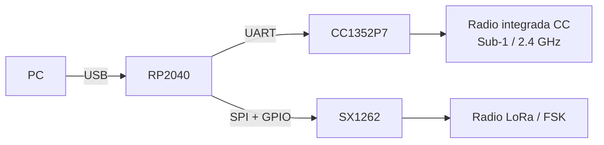

# RP2040, CC1352P7 y SX1262 — Quién hace qué

## En una frase

El RP2040 organiza comunicaciones y controla periféricos; el CC1352P7 ejecuta otra aplicación y opera su propia radio; el SX1262 es un radio periférico comandado por el RP2040.

## Modelo mental

Imagina una oficina:

- [[RP2040 - El procesador de interfaz|RP2040]] es recepción y coordinación: recibe al visitante (la PC), separa solicitudes y las entrega al destino correcto.
- [[CC1352P7 - El procesador de radio programable|CC1352P7]] es un especialista independiente con su propio escritorio, programa y herramientas de radio.
- [[SX1262 - El transceptor controlado por RP2040|SX1262]] es una máquina especializada: no decide el trabajo; el RP2040 la configura y le ordena transmitir o recibir.

La analogía sirve para responsabilidades, no para rendimiento ni prioridad.

## Comparación esencial

| Aspecto | RP2040 | CC1352P7/P74 | SX1262 |
|---|---|---|---|
| Tipo | MCU: microcontrolador programable | SoC inalámbrico: procesador y radio integrados | Transceptor de radio periférico |
| ¿Ejecuta imagen del proyecto? | Sí | Sí | No, se configura mediante comandos |
| Responsabilidad principal | USB, tres CDC, puente, shell, SX1262 y control de placa | Aplicación RF independiente sobre su radio integrada | Modulación/recepción LoRa y FSK según órdenes RP2040 |
| Enlace con RP2040 | Es el centro | UART + BOOT/RESET/debug | SPI + CS/RESET/BUSY/DIO1 |
| Camino desde PC | USB llega directamente | Indirecto por Cat-Bridge/RP/UART | Indirecto por Shell/LoRa/RP/SPI-GPIO |
| Firmware oficial | Zephyr, `RP2040/catsniffer/` | Imagen normal binaria y proyectos TI especializados | Driver SX1262 ejecutado por RP2040 |
| Relación con FeralRF | Se conserva | Su imagen oficial es la que FeralRF sustituye | No participa en FeralRF |

**MCU** significa microcontrolador: CPU, memoria y periféricos en un chip. **SoC** significa sistema en chip; aquí destaca que CC1352P7 combina MCU y subsistema RF. Un **transceptor** transmite y recibe radio, pero SX1262 no es el lugar donde corre la aplicación CatSniffer.

## Cómo se reparten los radios

No hay un único “controlador de todos los radios”. La propiedad depende del dispositivo: el CC gobierna su radio integrada; el RP gobierna SX1262.

## Por qué existen dos procesadores

La evidencia muestra una separación de funciones, no una redundancia:

- RP2040 ofrece una interfaz USB flexible y puede presentar varias funciones a la PC.
- CC1352P7 ejecuta aplicaciones TI especializadas y dispone de radio multibanda integrada.
- El enlace UART permite actualizar o cambiar el comportamiento del CC sin convertirlo en un periférico pasivo.

Esta separación también permite que [[Arquitectura FeralRF|FeralRF]] cambie el software del CC sin reemplazar el software USB del RP.

## Concepción errónea común

**“CC1352P7 y SX1262 son dos radios equivalentes detrás del RP2040.”** No. CC1352P7 es un procesador autónomo con radio y firmware propio; SX1262 es un transceptor comandado directamente por el RP2040.

## Por qué esto importa después

Cuando una operación falla o debe modificarse, primero hay que decidir quién es dueño del comportamiento. Un problema de enumeración USB apunta al RP2040/host; una semántica del firmware FeralRF apunta al CC1352P7; una configuración LoRa oficial apunta al RP2040 y su driver SX1262.

## Evidencia

- [[Arquitectura CatSniffer v3.1]]
- [[Mapa de firmware oficial]]
- [[Fuentes hardware CatSniffer v3.1]]
- [[Fuentes firmware oficial]]

## Comprueba tu comprensión

1. ¿Por qué SX1262 no aparece en el mapa de imágenes de firmware?
2. ¿Qué procesador interpreta una orden local de Cat-Shell?
3. ¿Qué diferencia hace que FeralRF pueda ejecutar en CC1352P7 pero no en SX1262?
4. ¿Quién termina el USB y quién termina el protocolo RF del CC?

**Anterior:** [[Arquitectura CatSniffer v3.1]]  
**Siguiente:** [[RP2040 - El procesador de interfaz]]

