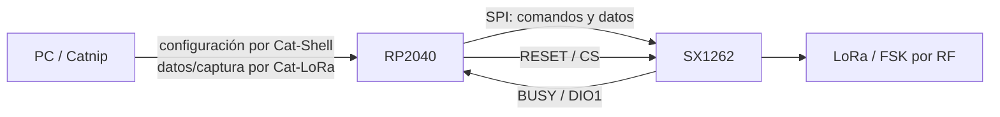

# SX1262 — El transceptor controlado por RP2040

## En una frase

SX1262 es un transceptor LoRa/FSK que el RP2040 configura y opera mediante SPI y GPIO; no ejecuta una imagen de aplicación independiente de CatSniffer.

## Modelo mental

SX1262 es más parecido a una tarjeta de red controlada por un procesador que a un segundo computador de propósito general. [[RP2040 - El procesador de interfaz|RP2040]] le envía órdenes, espera estados y recibe interrupciones.

## Qué ocurre técnicamente

- **SPI** transporta comandos y datos con reloj, líneas de datos y chip-select.
- `RESET` reinicia el transceptor.
- `BUSY` indica cuándo el chip aún no acepta otra operación.
- `DIO1` señala eventos al RP2040, por ejemplo una operación de radio terminada.
- El firmware RP2040 usa la API LoRa de Zephyr y el driver SX1262.

## Qué software corre dónde

La lógica de aplicación y el driver corren en RP2040. SX1262 contiene lógica interna del fabricante, pero no recibe un UF2/HEX de aplicación del proyecto como RP2040 o CC1352P7. Durante runtime se configura mediante registros y comandos.

## Relación con Cat-LoRa y Cat-Shell

La arquitectura oficial reparte la ruta SX1262 entre dos CDC:

- Cat-Shell configura parámetros y funciones locales interpretadas por RP2040.
- Cat-LoRa transporta datos/stream relacionados con la operación del radio.

Consulta [[USB CDC - Cómo CatSniffer aparece ante la PC]] y [[Del PC a la radio - Rutas de extremo a extremo]].

## Relación con FeralRF

FeralRF no usa SX1262 ni Cat-LoRa. Corre en [[CC1352P7 - El procesador de radio programable|CC1352P7]] y opera la radio integrada de ese SoC. Que ambos puedan trabajar en Sub-1 GHz no los convierte en la misma ruta.

## Concepción errónea común

**“FeralRF reemplaza el firmware del SX1262.”** No existe una imagen de aplicación SX1262 que FeralRF sustituya. FeralRF reemplaza la imagen del CC1352P7.

## Por qué esto importa después

Esta distinción evita atribuir problemas LoRa oficiales a FeralRF y aclara que una prueba futura de SX1262 necesita observar el firmware RP2040, Cat-Shell/Cat-LoRa y las señales SPI/GPIO, no el protocolo FeralRF.

## Evidencia

- `CatSniffer:v3.1:hardware/CatSniffer.kicad_sch`, U7 y sus nets.
- `CatSniffer-Firmware/RP2040/catsniffer/boards/rpi_pico.overlay`.
- `CatSniffer-Firmware/RP2040/catsniffer/src/main.c`.
- Síntesis: [[Arquitectura CatSniffer v3.1]], [[Firmware RP2040]], [[Fuentes hardware CatSniffer v3.1]].

## Comprueba tu comprensión

1. ¿Qué procesador ejecuta el driver SX1262?
2. ¿Por qué BUSY y DIO1 son GPIO y no el canal principal de datos?
3. ¿Qué CDC se relacionan con SX1262 y para qué?
4. ¿Por qué FeralRF puede ignorar SX1262 y seguir siendo útil?

**Anterior:** [[CC1352P7 - El procesador de radio programable]]  
**Siguiente:** [[Mapa de firmware oficial]]

