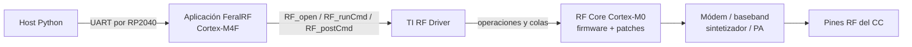
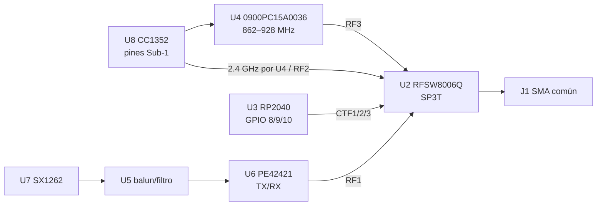

# Sub-GHz en CatSniffer V3 — CC1352P7, ruta RF y control de banda

## Respuesta directa

**Sí: el componente observado, CC1352P7, genera y recibe Sub-GHz por sí mismo.** No necesita que el RP2040 ni el SX1262 creen la modulación proprietary de FeralRF. Dentro del CC, la aplicación corre en el Cortex-M4F, usa el TI RF Driver para entregar comandos al RF Core Cortex-M0, y el módem, sintetizador y bloque RF integrados ejecutan GFSK/FSK y las operaciones RX/TX.

Eso no basta para que la señal llegue a la antena. En CatSniffer hay redes pasivas y conmutadores externos. Para la ruta CC Sub-GHz del diseño publicado, el RP2040 debe seleccionar U2 mediante `CTF1/2/3`; U4 debe admitir la frecuencia; el conector, antena y montaje deben ser compatibles. El SX1262 es otro transceptor, con su propia ruta y control SPI desde el RP2040; no interviene en `configure_prop()` ni en `TX_RAW` de FeralRF.

Esta conclusión distingue cinco niveles:

| Nivel | Estado |
|---|---|
| Capacidad del silicio | CC1352P7 admite Sub-GHz nativo en bandas especificadas y varios esquemas de modulación. |
| Implementación de firmware | FeralRF configura y llama operaciones proprietary reales del RF Core para 868/915 MHz. |
| Compatibilidad PCB publicada | U4 documenta 862–928 MHz y U2 conecta esa rama a J1 cuando el RP2040 selecciona `band2`. |
| Configuración en ejecución | La sesión mostró ACK y estado lógico `Band: 1`; no hubo lectura de registros RF ni de niveles CTF. |
| Comportamiento físico validado | Las 24 corridas acumuladas no entregaron paquetes proprietary al host receptor; no demuestran emisión ni recepción proprietary física. |

## Alcance, identidad y versiones

**Evidencia de fabricante:** la ficha SWRS251A identifica CC1352P7 como MCU multibanda Sub-1 GHz/2.4 GHz. El marcaje de parte listado es `CC1352 P74`/`CC1352P74T0RGZR`.

**Observado en hardware, registrado previamente:** U8 de la unidad CatSniffer v3.1 fue informado como marcado `CC1352P74`. Por tanto, “CC1252P7” y “RP2049” se tratan como erratas de CC1352P7 y RP2040, no como dispositivos adicionales.

**Evidencia de diseño:** el tag `CatSniffer:v3.1` (`5b99d984…`) llama U8 `CC1352P1F3RGZT`. El PCB lleva serigrafía v3.1, el bloque de título del PCB dice v3.2 y el esquema dice rev. 2.0. No hay BOM independiente, Gerbers, ECO o foto incorporada que vincule sin ambigüedad la unidad P7 con una revisión exacta de esos archivos.

**Conclusión:** se conoce la familia del componente físico (P7) y la placa se ha registrado como CatSniffer v3.1; queda sin verificar la revisión eléctrica/fabricación exacta del ensamblaje. La topología siguiente está verificada contra el diseño publicado en el tag v3.1, no por continuidad de las dos placas usadas.

Líneas base leídas sin cambiar checkout:

- FeralRF `0178721cbd4f0d0f6f8eba5ae919ca46066d5dea`.
- SDK `simplelink_cc13xx_cc26xx_sdk_8_30_01_01`, `5b31d0a4903351e544546e23ef3330eaa4291ceb`.
- CatSniffer-Firmware `c0cd5a45e019dbd14ed11d039aacb13f300e5731`; comparación adicional con `8eaa84c0b7…`.
- Hardware CatSniffer tag v3.1 `5b99d984933a8b8c36e789853c08d3a2a785bed4`.

El detalle de procedencia está en [[Fuentes primarias Sub-GHz - CC1352P7 y ruta RF]].

## Qué significa modular

La **frecuencia portadora** sitúa la señal en el espectro: 868 MHz y 915 MHz son centros de sintonía. La **modulación** codifica información variando alguna propiedad de esa portadora.

- En **FSK binaria**, dos frecuencias representan los dos símbolos binarios. La **desviación** es la separación de cada tono respecto al centro.
- En **GFSK**, los bits pasan antes por un filtro gaussiano; se suavizan las transiciones y se reduce energía fuera del canal. Sigue siendo FSK, no LoRa.
- En **4-FSK/4-GFSK**, cuatro tonos representan cuatro símbolos; un símbolo puede transportar dos bits. Por eso tasa de bits y tasa de símbolos no siempre coinciden. La capacidad del silicio no demuestra que el mapeo `mod_type=5/6` de esta implementación sea válido.
- **Bit rate** cuenta bits por segundo; **symbol rate** cuenta símbolos por segundo. En FSK/GFSK binaria sin codificación son numéricamente iguales. En cuatro niveles pueden diferir por un factor de dos, además de cualquier codificación.
- El **ancho de banda RX** debe admitir la tasa y desviación, pero también excluir energía vecina. En FeralRF `rx_bw` es un código TI, no un número de Hz.
- El receptor busca preámbulo y **palabra de sincronía**, interpreta longitud y valida CRC. Dos radios con frecuencia pero framing o sincronía diferentes no intercambian paquetes.

Un switch como U2 solo conecta uno de sus puertos RF al puerto común. No posee sintetizador ni módem y, por tanto, no puede crear GFSK.

## Capacidad nativa del CC1352P7

La ficha SWRS251A especifica estas bandas: `287–351`, `359–527`, `861–1054`, `1076–1315` y `2360–2500 MHz`. Declara 2-(G)FSK, 4-(G)FSK, (G)MSK, ASK/OOK y PHY/estándares concretos. Son capacidades del radio, no una promesa de que FeralRF implemente todos sus protocolos o que cualquier PCB los enrute.

Consecuencias para los presets presentes:

- 433.92, 868, 902.2, 915 y 2440 MHz caen dentro de bandas del silicio.
- **169.45 MHz queda fuera de la especificación del CC1352P7.** Los dos presets `wireless_mbus_n_169_*` y el bloque de overrides llamado 169 en FeralRF no cambian ese límite.
- U4 `0900PC15A0036` del diseño publicado solo especifica 862–928 y 2400–2500 MHz. Así, 433 puede ser posible en el silicio pero no está sustentado por ese frente RF; 169 no está sustentado ni por silicio ni por U4.
- La ficha de silicio anuncia stacks/PHY disponibles en el ecosistema. Un nombre `wireless_mbus_*`, `wisun_*`, `sidewalk_*` o `mioty_*` en un diccionario Python no implementa por sí solo MAC, hopping, tiempos, codificación o interoperabilidad.

## Cooperación dentro del CC

- **CPU de aplicación M4F:** recibe el protocolo FeralRF, conserva configuración, arma estructuras y decide iniciar/parar RX/TX.
- **TI RF Driver:** administra el cliente, dominio de potencia, cola y entrega de operaciones. No es otro chip.
- **RF Core M0:** ejecuta autónomamente operaciones sensibles al tiempo, aplica firmware/patches y mueve datos de las colas. TI indica que no lo programa directamente el usuario.
- **Hardware RF:** sintetiza portadora, modula/demodula, filtra en baseband, convierte RF y usa el PA/ruta seleccionados.

La aplicación no genera una forma de onda muestra por muestra. Configura un PHY que el módem soporta. Tampoco implica soporte para formas arbitrarias.

## Responsabilidades de los tres componentes principales

| Componente | Función comprobada | No debe inferirse |
|---|---|---|
| CC1352P7 U8 | MCU que ejecuta FeralRF y radio integrado que realiza proprietary Sub-GHz/2.4; comunica con host por UART. | Que use SX1262; que todo preset sea válido; que el PA +20 dBm esté conectado. |
| RP2040 U3 | Termina USB, puentea UART al CC, ofrece Shell, maneja SX1262 por SPI/GPIO y escribe los selectores externos U2/U6. | Que module el GFSK configurado en el CC; que `Band: 1` sea lectura física. |
| SX1262 U7 | Transceptor separado 150–960 MHz para LoRa/LR-FHSS/(G)FSK, controlado por RP2040 y conectado a su propio frente U5/U6. | Que participe en la ruta proprietary de `python/feralrf/radio.py`; que `Radio: LoRa` describa al CC. |

## Topología RF del diseño publicado

Esquema `CatSniffer:v3.1:hardware/CatSniffer.kicad_sch`, hoja única rev. 2.0; conectividad corroborada con `CatSniffer.kicad_pcb`. “NC” significa que el archivo PCB marca explícitamente el pad sin red.

| señal/net | componente/pin origen | componente/pin destino | propósito | evidencia | cuestión no resuelta |
|---|---|---|---|---|---|
| `/2_4_GHZ_RF_P`, `/2_4_GHZ_RF_N` | U8 `RF_P_2_4GHZ` pads 1 y 2 | U4 pads 8 y 9 | par diferencial CC 2.4 GHz | esquema/PCB v3.1 | población/continuidad física |
| `/SUB_1_GHZ_RF_P`, `/SUB_1_GHZ_RF_N` | U8 `RF_P_SUB_1GHZ` pads 3 y 4 | U4 pads 6 y 7 | par diferencial CC Sub-GHz | esquema/PCB v3.1 | población/continuidad física |
| `TX_20DBM_P/N` | U8 pads 5 y 6 | NC | salida dedicada del PA alto del P1 dibujado | PCB v3.1 | adaptación exacta al P7 montado; no hay ruta publicada de estos pads |
| `/RX_TX` | U8 pad 7 | U4 pad 5 | control/puerto auxiliar del componente pasivo | esquema/PCB v3.1 | comportamiento con P7 físico |
| `/UBP_2_4_GHZ` | U4 pin 1 | C7 100 pF → U2 RF2 pin 8 | rama CC 2.4 GHz desbalanceada | esquema/PCB; datasheet U4 | respuesta ensamblada |
| `/UBP_SUB-1_GHZ` | U4 pin 4 | C23/C8 100 pF → U2 RF3 pin 5 | rama CC 862–928 MHz | esquema/PCB; datasheet U4 | respuesta/pérdida real |
| `RFI_P`, `RFI_N`, `RFO` | U7 SX1262 | U5 `0900FM15D0039` pins 4, 3, 1 | adaptación/filtro SX1262 | esquema v3.1; ficha U5 | parte poblada y desempeño a 868 |
| `SW_RFI`, `SW_RFO` | U5 pins 6 y 8 | U6 PE42421 RF2 pin 3 / RF1 pin 1 | separa RX/TX SX1262 | esquema/PCB; ficha U6 | posición física de JP1 |
| `/LORA_O` | U6 RFC pin 5 → C20/L3/C25/C26 | C6 100 pF → U2 RF1 pin 4 | rama SX1262 hacia U2 | esquema/PCB v3.1 | ajuste y continuidad reales |
| `ANT` | U2 ANT pin 2 | C9 100 pF → J1 SMA pin 1 | puerto común, antena compartida | esquema/PCB v3.1 | antena/cable exactos no verificados |
| `CTF1/2/3` | U3 RP2040 GPIO 8/9/10 | U2 CRF1 pin 3, CRF2 pin 7, CRF3 pin 6 | selección SP3T | esquema/PCB + overlay y `change_band()` | niveles físicos no medidos |
| `ANT_SW` | U3 GPIO20 | R7 → U6 V1 pin 6 | selector TX/RX SX | esquema/PCB | estado físico no medido |
| `/DIO22` o SX `DIO2` | U3 GPIO21 o U7 DIO2 vía JP1 | R8 → U6 V2 pin 4 | segundo control de U6 | esquema/PCB | posición de puente JP1 no verificada |
| `DIO28/29/30` | U8 pads 41/42/43 | NC en PCB publicado | selectores de LaunchPad esperados por SysConfig | PCB v3.1 + `ti_drivers_config.c` | una revisión física posterior podría diferir |

U4/U5 son redes pasivas integradas y U2/U6 son switches; no se encontró un PA externo activo en la ruta descrita. El P7 sí integra PA, pero el diseño publicado deja `TX_20DBM_P/N` sin conectar. Por eso la tabla High-PA de FeralRF no demuestra que +20 dBm llegue a J1.

El diagrama representa el cableado publicado; no pretende representar como verificada la revisión exacta de las unidades.

## Quién selecciona la ruta externa

En CatSniffer-Firmware `c0cd5a4…`:

- `enum BAND`: `GIG=0`, `SUBGIG_1=1`, `SUBGIG_2=2`.
- `band1` llama `change_band(GIG)` y escribe CTF `0,1,0`.
- `band2` llama `change_band(SUBGIG_1)` y escribe `0,0,1`.
- `band3` llama `change_band(SUBGIG_2)` y escribe `1,0,0`.
- El overlay asigna CTF1/2/3 a RP2040 GPIO 8/9/10.
- `change_band()` retorna sin escribir si el valor solicitado coincide con `catsniffer.band`.
- `catsniffer_t catsniffer={0}` inicia el cache en `GIG`. Por ello el `change_band(GIG)` del arranque puede retornar antes de fijar los tres niveles. La transición forzada `band1 → band2` registrada sí recorre escrituras para ambos estados según el código.

`Band: 1` es el cache, no readback de GPIO ni de U2. `Radio: LoRa`, `LoRa: initialized` y `LoRa Mode: Stream` describen `current_modulation` y estado del subsistema SX1262 del RP2040; no indican por qué transceptor viajó un comando enviado por el puerto Bridge. Pueden inducir a una lectura equivocada si se usan como prueba de la ruta FeralRF.

La comparación `8eaa84c…` frente a `c0cd5a4…` no encontró cambios en enum, overlay o `change_band()`; la diferencia relevante observada en esos archivos fue la línea `Board:` añadida a `fw_version`. No se atribuye causalidad a la diferencia de versiones.

### DIO del CC frente a CTF del RP2040

El build TI-RTOS de FeralRF incluye `syscfg/ti_drivers_config.c`, generado para `LP_CC1352P7_4`. Su callback de antena usa DIO28/29/30 con una tabla LaunchPad y se activa en `RF_GlobalEventRadioSetup`. Sin embargo, esos pads de U8 están explícitamente NC en el PCB v3.1; U2 está conectado a GPIO8/9/10 del RP2040.

**Conclusión de código + esquema:** la callback puede escoger el frente de una LaunchPad conceptual, pero no controla U2 en el diseño CatSniffer publicado. No se encontró una adaptación FeralRF que mande `band2` al RP2040. `set_phy()` cambia estado/comandos internos del CC, no el selector U2. La única reserva es que falta el diseño exacto de la revisión P7 ensamblada.

## Traza proprietary versionada

**Procesador:** host PC → CC1352P7 M4F/RF Core. **Componente controlado:** radio integrado de U8. **Interfaz:** USB/UART FeralRF y TI RF Driver. **Fuente:** FeralRF `0178721c…`, SDK `8.30.01.01` `5b31d0a…`.

1. `PROP_PRESETS[name]` entrega valores a `Radio.configure_prop()`.
2. `CommandBuilder.set_prop_config()` serializa 18 bytes para `SET_PROP_CONFIG=0x08`: frecuencia U32, tipo U8, tasa U32, desviación U16, `rx_bw` U8, sync U32 y `format_conf` U16.
3. `command_processor.c` acepta 18 bytes o 16 legacy, llena `RadioIF_PropConfig`, llama `RadioIF_setPropConfig()` y envía ACK.
4. `RadioIF_setPropConfig()` calcula frecuencia entera/fraccional de `CMD_FS`, `loDivider`, `rateWord`, escribe modulación, desviación, `rxBw`, formato y sync; selecciona overrides.
5. El setup es `CMD_PROP_RADIO_DIV_SETUP_PA` (`0x3807`) con patch CPE proprietary/multiprotocolo según ruta. `CMD_FS` (`0x0803`) programa el sintetizador.
6. RX usa `CMD_PROP_RX` (`0x3802`) continuo; TX usa `CMD_PROP_TX` (`0x3801`). El RF Driver entrega las operaciones al RF Core.
7. En RX, la cola RF se transforma en `RadioIF_RxPacket`, luego `DataTask_emitRxPacket()` crea `RSP_RX_PACKET`, y Python produce `Packet`.

La ACK de `SET_PROP_CONFIG` confirma que el parser almacenó/aplicó estructuras en software; no lee de vuelta el módem. La ACK de `TX_RAW` se emite tras copiar/enrolar la solicitud, antes de que `DataTask` llame a `RF_runCmd()`. Si la ejecución posterior falla, el firmware intenta emitir `RSP_ERROR` asíncrono. Por tanto, un retorno exitoso de `transmit()` no prueba terminación RF.

### Parámetros de `gfsk_868_50k` y `gfsk_915_50k`

| Parámetro | 868 | 915 | mapeo efectivo en fuente |
|---|---:|---:|---|
| frecuencia | 868000000 Hz | 915000000 Hz | `CMD_FS.frequency` 868/915, fracción 0; `centerFreq`; `loDivider=0x05` |
| modulación | `mod_type=1` | igual | GFSK según `rf_prop_cmd.h` |
| tasa de símbolos | 50000 baud | igual | `preScale=15`, `rateWord=0x8000`; GFSK binaria implica 50 kbit/s antes de framing |
| desviación | `100` | igual | registro 100 con `deviationStepSz=0`; 100 × 250 Hz = 25 kHz |
| ancho RX | `0x52` | igual | código escrito a `rxBw`; no es 0x52 Hz ni se confirmó por readback |
| sync | `0x930B51DE` | igual | TX y RX, 32 bits, MSB primero |
| preámbulo | no está en preset | igual | setup conserva cuatro bytes |
| framing | no está en preset | igual | longitud variable, sin filtro de dirección, máximo RX 255; un byte de longitud según comandos |
| CRC | no está en preset | igual | habilitado en `CMD_PROP_TX/RX`; RX repite tras paquete válido o inválido |
| whitening/FEC | `format_conf` omitido → 0 | igual | default `0x00A0`: sin whitening, FEC binaria sin codificar |
| potencia | helper `set_power(0)` y `transmit(..., power_dbm=0)` | igual | tabla Sub-1 encuentra entrada solicitada 0 dBm y llama `RF_setTxPower`; potencia en J1 no medida |
| overrides | no está en preset | igual | rama estándar `>=861 MHz`, `Prop0_pOverrides*` |

Estos son valores configurados en fuente. La sesión no capturó registros del RF Core, frecuencia/potencia con instrumento ni paquetes recibidos.

## El helper OTA y las fronteras de buffering

El `Invoke-FeralPresetOta` documentado inicializa y configura ambos radios, inicia RX, consume una ventana negativa de 3 s, hace diez solicitudes TX separadas 100 ms y después consume una ventana positiva de 5 s. Cuenta solo `Packet` con CRC válido cuyo `data` contiene el marcador y cuenta `RxStreamError`. En `finally` intenta `stop_rx()`/`disconnect()` y suprime excepciones.

No existe lector Python de fondo: `read_packets()` lee en el hilo llamador. Durante el bucle TX no se itera el receptor. El CC, RP2040, USB y sistema operativo pueden seguir acumulando datos, pero eso no cuantifica cuánto ni prueba pérdida.

| frontera | capacidad/comportamiento demostrado por código | pérdida/error visible |
|---|---|---|
| RF Core → buffer CC | 3 entradas de 270 bytes; callback por entrada llena/buffer lleno | el backend cancela/reinicia ante overflow; métricas RX pueden incrementarse |
| cola interna CC | 8 `RadioIF_RxPacket` | lleno incrementa `rx_drop` |
| CC → salida UART | 32 tramas; máximo 4 drenadas por pasada | lleno incrementa contador propio y fija evento; no se convierte necesariamente en `RxStreamError` |
| RP2040 puente | seis rings de 16 KiB en la revisión examinada | `uart_overrun` y bytes `ring_dropped`; los 326 bytes de #2 ya estaban antes de estas corridas |
| USB/driver/pyserial | capacidad no fijada por el código examinado | no cuantificada |
| Python | `bytearray` y deques sin máximo explícito, pero solo se llenan al leer | no hay hilo que drene durante TX |

`RSP_ERROR` asíncrono con seq 0/0xFF llega a `RxStreamError` si Python lo lee. `errors=0` solo significa que ese tipo de objeto no salió en esas ventanas. CRC fallido, colas llenas, bytes perdidos en otras fronteras, respuestas inesperadas descartadas o excepciones de cleanup pueden no aparecer allí.

`CMD_PROP_RX` se publica con repetición y trigger final `TRIG_NEVER`; al llenar el buffer se cancela, restablece la cola y vuelve a publicar. `RX_STOP` se ACKea al programar el evento; la detención real se ejecuta después con cancel + flush. `disconnect()` solo cierra el puerto. Si los tres intentos de `stop_rx()` fallan, el `finally` lo oculta y podría quedar estado hasta un comando posterior; es una hipótesis de ciclo de vida, no un defecto demostrado en estas corridas. La inicialización siguiente programa un stop/reset de métricas de forma diferida y su ACK tampoco constituye observación física.

## Cobertura real de presets

Inventario de `python/feralrf/presets.py` en `0178721c…`:

| grupo | presets | silicio P7 | backend examinado | PCB/frente publicado | evidencia OTA actual |
|---|---|---|---|---|---|
| 169.45 GFSK | `wireless_mbus_n_169_2k4`, `_4k8` | **fuera de especificación** | existe rama/override, no vuelve válido el silicio | U4 no cubre 169 | ninguna; no debe ensayarse como preset soportado |
| 433.92 | `gfsk_433_50k`, `_10k`, `fsk_433_50k`, `ook_433_*`, `msk_433_50k`, `4fsk_433_50k`, `4gfsk_433_50k` | frecuencia dentro | FSK/GFSK/OOK tienen estructuras/patches; valores 4/5/6 son reservados en el comando exacto inspeccionado | U4 no cubre 433 | no establecida para esta ruta |
| 868 | `gfsk_868_50k`, `_100k`, `ook_868_4k8`, `msk_868_50k`, W-MBus S/T/C, `4fsk/4gfsk_868_50k`, `mioty_868_tsunb` | frecuencia dentro; esquemas dependen del caso | GFSK/FSK/OOK configurables; 4/5/6 reservados en el setup auditado; MIOTY pending | U4 sí cubre 862–928; antena requerida | GFSK y W-MBus S/T/C ejecutados, cero entregas; MSK/4-(G)FSK no demuestran modulación nominal |
| 902.2/915 | `gfsk_902_50k`, `gfsk_915_50k`, Sidewalk FSK 50/250k, Wi-SUN FSK 50/100/150/200/300k | frecuencia dentro | `mod_type=0/1`; no hay stack Sidewalk/Wi-SUN probado por el nombre | U4 sí cubre; antena requerida | ejecutados, cero entregas; Wi-SUN/Sidewalk actual `0/70` |
| 2440 | `gfsk_2440_250k`, `_50k` | frecuencia dentro | setup proprietary compartido | U4 sí cubre 2400–2500 y selección `band1` | ejecutados, incluidos controles concurrentes; cero eventos/paquetes |

Prerrequisitos para una campaña interpretable:

1. Excluir 169 como no soportado por el P7 y separar 433 como incompatible con el frente publicado hasta nueva evidencia de hardware.
2. Confirmar selector externo antes de cada grupo y registrar niveles CTF o continuidad, no solo `Band` cacheado.
3. Confirmar antena/conector y banda de ambos equipos.
4. Registrar antes/después estadísticas CC, contadores RP2040 y stdout literal de ambos lados.
5. Mantener lector RX concurrente o justificar con medición que las colas soportan el intervalo; diferenciar cualquier cambio de procedimiento de la evidencia previa.
6. Verificar formato real de cada familia; no usar etiquetas de protocolo como prueba de stack.
7. Probar recuperación entre presets, en especial OOK y cualquier stop fallido, con un control conocido antes/después.
8. Exigir una observación RF independiente o recepción del marcador para promover un caso de control a validación física.

## Qué demuestra el primer corte de cuatro corridas

Resultados literales conservados en [[Reporte OTA Sub-GHz - GFSK 868 y 915 MHz]]:

| # | preset y dirección | marcador | resultado disponible |
|---:|---|---|---|
| 1 | `gfsk_868_50k`, COM33 → COM88 | `b10133008801` | `acks=10, hits=0, errors=0`; stdout completo no disponible |
| 2 | `gfsk_868_50k`, COM88 → COM33 | `b10288003301` | `NEG hits=0 errors=0`; `RESULT ... acks=10 hits=0 errors=0` |
| 3 | repetición #2 | mismo | mismo resultado literal |
| 4 | `gfsk_915_50k`, COM33 → COM88 | `b11133008801` | `NEG hits=0 errors=0`; `RESULT ... acks=10 hits=0 errors=0` |

Sí demuestran 40 aceptaciones de solicitudes por la API en las ventanas descritas, configuración intentada en ambas direcciones/bandas y ausencia de `RX_ITEM` en las capturas positivas disponibles. Son compatibles con una lista positiva vacía.

No demuestran 40 emisiones completadas, pérdida RF de 100 %, cero paquetes totales, ausencia de overflow, potencia/frecuencia correctas, ruta U2 correcta ni antenas adecuadas. `hits=0` solo niega el marcador bajo el filtro del helper; `errors=0` solo niega `RxStreamError` expuesto. Los contadores RP2040 iguales antes/después no cubren las otras colas, y los 326 bytes de #2 no se atribuyen a estas pruebas.

La condición reportada de ~2 cm y después mayor separación con antena orientada no estuvo medida en la segunda posición. Modelos, respuesta y encaminamiento de las antenas siguen sin verificar.

## Actualización de la segunda campaña

[[Segunda campaña OTA proprietary FeralRF — Ampliación de presets y verificación del procedimiento]] añadió 20 corridas y 200 retornos exitosos. El acumulado es 24 corridas, 240 retornos, 19 presets únicos, cero paquetes/hits y cero errores asíncronos expuestos.

El control concurrente `gfsk_2440_50k` mantuvo RX activo durante los ACK TX y por `24.690 s` después del último. Esto debilita la lectura tardía como explicación única sin demostrar emisión. Los contadores expuestos `rx_ok`, `rx_crc_err`, `rx_drop` y `rx_overflow` permanecieron en cero en ambos dispositivos para el intervalo pertinente; no cubren toda la cadena.

Los casos GFSK/FSK en 868/902.2/915/2440 siguen siendo aptos para diagnóstico físico, no PASS-RF. Los presets `msk_868_50k`, `4fsk_868_50k` y `4gfsk_868_50k` solo acreditan aceptación: sus `modType` 4/5/6 están reservados en el setup TI auditado. La clasificación completa está en [[Seguimiento documental OTA Sub-GHz - ruta RF y control de banda#Clasificación actual A–D]].

## Hipótesis, evidencia y discriminadores

| hipótesis | evidencia que la apoya | evidencia que se opone o limita | observación mínima discriminante |
|---|---|---|---|
| U2 no quedó en la rama CC Sub-GHz | `set_phy()` no controla U2; `Band` es cache | transición forzada `band1→band2` ejecuta escrituras correctas en fuente | medir CTF1/2/3 e identificar el puerto seleccionado por tabla de verdad; observar la ruta con método RF apropiado |
| el CC no ejecutó TX pese al ACK | ACK antecede `RF_runCmd()` | no se capturó `RSP_ERROR`; otros modos FeralRF tienen evidencia RF previa | observar portadora/paquete en J1 y capturar evento/estado TX posterior |
| TX existe en pines CC pero no llega a J1 | revisión P7 exacta y ruta de PA no cerradas | esquema publicado sí ofrece ruta RF_P/N→U4→U2 para 862–928 | sondear secuencialmente salida CC/U4/U2 con equipo adecuado |
| RX produjo datos pero se perdieron en buffering | no hay lector host durante diez TX; varias colas finitas | solo diez tramas y no hay contador que pruebe overflow; no se debe inferir pérdida | lector concurrente + métricas/counters antes/después, manteniendo RF igual |
| configuración TX/RX no coincide efectivamente | no hay readback; backend aplica estructuras en diferido | ambos lados usan el mismo preset y código | captura de aire decodificada o lectura/telemetría de comandos/estados RF |
| antena/ruta externa inadecuada | modelos y respuesta desconocidos | se informaron antenas multibanda y distancia corta | VNA/antena conocida o carga/cableado de laboratorio apropiado, sin radiar campaña |
| lifecycle deja RX/estado residual | cleanup suprime errores; stop es diferido; `disconnect` no resetea | no hay evidencia de stop fallido en la campaña | registrar excepciones y estado/métricas tras cada stop, con control conocido |

Ninguna hipótesis se declara causa raíz.

## Próxima observación discriminante

La observación mínima de mayor rendimiento es **correlacionar, durante una sola solicitud `gfsk_868_50k`, los niveles físicos CTF `0,0,1` con actividad RF en J1**. Opciones futuras, sin ejecutarlas aquí:

1. Medir CTF1/2/3: se espera `0,0,1` para `band2`. Si no aparece, el problema precede a U2; si aparece, solo prueba control, no continuidad RF.
2. Determinar el puerto seleccionado por U2 con sus niveles de control y la tabla de verdad; evaluar la transferencia con SDR, analizador, VNA o receptor acoplado apropiado. Una medición ordinaria de continuidad DC a través del switch no prueba una ruta RF.
3. Observar J1 con analizador o receptor conocido al pedir un único TX: energía a 868 MHz con timing correlacionado demuestra actividad en el conector; demodular sync, tasa y marcador añade prueba de configuración. Ausencia en J1 aún requiere sondear antes/después de U4 para localizar la interrupción.
4. En paralelo lógico, capturar el resultado posterior de `RF_runCmd()` y métricas antes/después. Distingue ACK de finalización interna, pero no sustituye una observación RF.

Estas comprobaciones requieren autorización y equipamiento en una fase experimental; no se realizaron en esta investigación.

## Conclusiones etiquetadas

- **Fabricante:** CC1352P7 sí integra radio Sub-GHz, módem, sintetizador y PA; 169 MHz no está en sus bandas.
- **Esquema/PCB:** la rama CC Sub-GHz publicada pasa por U4 y U2 hasta J1; U2 lo gobierna el RP2040. DIO28/29/30 del CC están NC.
- **Código:** FeralRF implementa una ruta proprietary real para 868/915; ACK TX no es finalización RF. La callback de antena es configuración LaunchPad heredada.
- **Observación:** Shell reportó `Band: 0/1` según las transiciones, pero es cache; el acumulado actual es 24 corridas, 240 retornos `transmit()` exitosos y cero paquetes/hits proprietary entregados.
- **Hipótesis:** switch, adaptación, revisión, antena, ejecución RF o buffering siguen como categorías abiertas.
- **Conclusión:** la duda “¿puede modular el CC?” queda resuelta afirmativamente; “¿la ruta física funcionó en estas placas?” no quedó validada.
- **Verificación faltante:** niveles CTF, continuidad U2, revisión exacta ensamblada, señal en J1, identidad binaria y recepción decodificada.

## Enlaces

- [[Arquitectura CatSniffer v3.1]]
- [[RP2040, CC1352P7 y SX1262 - Quién hace qué]]
- [[Arquitectura FeralRF]]
- [[Protocolo y API Python]]
- [[Seguimiento documental OTA Sub-GHz - ruta RF y control de banda]]
- [[Fuentes primarias Sub-GHz - CC1352P7 y ruta RF]]
