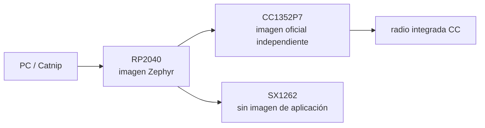
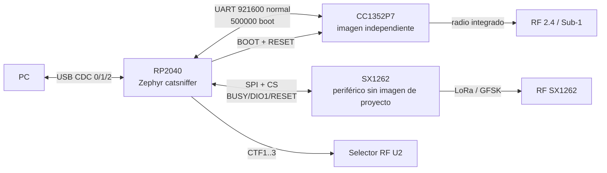

# Mapa de firmware oficial — Qué código corre dónde

## En una frase

CatSniffer ejecuta una imagen Zephyr en [[RP2040 - El procesador de interfaz|RP2040]] y otra imagen independiente en [[CC1352P7 - El procesador de radio programable|CC1352P7]]; [[SX1262 - El transceptor controlado por RP2040|SX1262]] es controlado por el firmware RP2040 y no recibe una aplicación separada.

## Modelo mental

Una **imagen de firmware** es el programa compilado que un procesador ejecuta desde su memoria. Tener dos procesadores implica dos ciclos de build, carga, arranque y depuración. El hecho de que ambos estén en la misma PCB no fusiona sus programas.



## Alcance y línea base

Esta nota resume **qué código se ejecuta dónde** en la CatSniffer v3.1 física. La línea base es `CatSniffer-Firmware/`, rama `v3.x`, commit `c0cd5a45e019dbd14ed11d039aacb13f300e5731`, tags en HEAD `v2.1.0.0` y `v3.1.0.1`; el árbol estaba limpio al iniciar el análisis.

- **Observado en hardware — 2026-09-25:** U8 está marcado `CC1352P74`; se analiza como CC1352P7-family.
- **Discrepancia preservada:** `CatSniffer:v3.1:hardware/CatSniffer.kicad_sch` dice `CC1352P1F3RGZT`. No hay evidencia local que explique cuándo o por qué cambió.
- **Conclusión:** la topología validada en Fase 1 sigue siendo aplicable, pero el target de firmware para la unidad física es P7.

## Propiedad del firmware

| Procesador/dispositivo | ¿Ejecuta firmware del proyecto? | Proyecto/imagen | Build | Responsabilidad principal | Hardware controlado | Comunicación | Carga/programación |
| --- | --- | --- | --- | --- | --- | --- | --- |
| RP2040 U3 | Sí | `RP2040/catsniffer/` | Zephyr + west + CMake, board `rpi_pico` | USB compuesto, puente al CC1352, control del SX1262, selección RF y consola | SX1262, reset/boot del CC, U2 mediante `CTF1..3`, LEDs | USB con PC; UART con CC; SPI/GPIO con SX1262 | UF2 por BOOTSEL/USB; salidas documentadas UF2/HEX/ELF; SWD sólo parcialmente accesible según Fase 1 |
| CC1352P7-family U8 | Sí | normal aparente: `CC1352P7/sniffer_fw_cc1252P_7/sniffer_fw_Catsniffer_v3.x.hex`; además tres proyectos especializados con fuente | CCS/SysConfig/SimpleLink; TI-RTOS o TI-RTOS7; TI compiler/TI Clang según proyecto | Ejecutar una aplicación RF independiente sobre el radio integrado 2.4/Sub-1 GHz | Radio y periféricos internos del CC | UART con RP2040; cJTAG/debug | Bootloader serie mediante USB→RP2040→UART y BOOT/RESET; o cJTAG/J3/CCS |
| SX1262 U7 | **No** | No existe proyecto/imagen independiente | Driver LoRa de Zephyr, externo al árbol de la aplicación | Periférico RF LoRa/(G)FSK comandado por RP2040 | — | SPI + CS, RESET, BUSY y DIO1 | No se flashea como procesador; se configura con comandos en ejecución |

## Tres canales USB de ejecución

**Observado en código:** `RP2040/catsniffer/boards/rpi_pico.overlay` crea tres dispositivos CDC-ACM:

1. `Cat-Bridge` (`cdc_acm_uart0`): puente transparente PC ↔ CC1352.
2. `Cat-LoRa` (`cdc_acm_uart1`): datos/comandos de radio que procesa el RP2040 y ejecuta el SX1262.
3. `Cat-Shell` (`cdc_acm_uart2`): consola local del RP2040 para modo boot/passthrough, banda, radio y estado.

`src/USB/usbd_init.c` registra las clases CDC en la pila USB nueva de Zephyr. Este USB de ejecución es distinto del modo ROM BOOTSEL usado para copiar UF2 al RP2040.

## Relación de las imágenes



## Arquitectura de compilación

### RP2040

`RP2040/catsniffer/CMakeLists.txt` define una aplicación Zephyr y compila `src/*.c`, `src/USB/usbd_init.c` y `src/shell_commands.c` cuando está activa la pila USB nueva. `prj.conf` habilita UART por interrupción, USB CDC-ACM, SPI, LoRa, GPIO, flash/NVS y settings. `west.yml` selecciona el fork `wero1414/zephyr`, revisión por nombre de rama `fsk-native-driver`, no un SHA inmutable. `VERSION` declara `0.2.0.0-dual-mode`.

El README documenta Zephyr 4.1, `west build ... -b rpi_pico` y artefactos UF2/HEX/ELF. No se compiló nada en esta fase.

### CC1352P7

Los proyectos CCS contienen `.project`, `.cproject`, `.syscfg` y `targetConfigs/CC1352P7.ccxml`. Los ejemplos Airtag usan SimpleLink SDK `7.10.01.24`, TI-RTOS7 y target `LP_CC1352P7_1`; JustWorks usa SDK `8.31.00.11`, TI-RTOS7, TI Clang, device `CC1352P7RGZ` y board `LP_CC1352P7_1`. Producen `.out` y/o Intel HEX mediante la utilidad TI.

La imagen de uso normal aparente, `sniffer_fw_Catsniffer_v3.x.hex`, tiene metadatos CCS dirigidos a `Cortex M.CC1352P7`/`DeviceFamily_CC13X2X7`, pero su fuente ya no está en HEAD. Por tanto no puede trazarse su ejecución interna desde esta línea base.

## Inventario CC1352P7 y clasificación

| Ruta | Fuente | Target/configuración | Papel aparente | Confianza y límite |
| --- | --- | --- | --- | --- |
| `CC1352P7/sniffer_fw_cc1252P_7/` | Binario + metadatos CCS; sin C actual | `Cortex M.CC1352P7`, familia CC13X2X7; TI-RTOS | Sniffer multiprotocolo para operación normal CatSniffer v3.x | **Documentado/observado:** README y nombre de HEX. Internos no visibles. El nombre `cc1252` parece typo y no es target técnico. |
| `CC1352P7/airtag_scanner_CC1352P_7/` | Sí | `LP_CC1352P7_1`, SDK 7.10.01.24 | Escáner BLE/AirTag que reporta por UART | Proyecto especializado, no prueba el comportamiento del sniffer normal. |
| `CC1352P7/airtag_spoofer_CC1352P_7/` | Sí | `LP_CC1352P7_1`, SDK 7.10.01.24 | Aplicación BLE periférica/anunciante | Especializado/experimental respecto al flujo normal. |
| `CC1352P7/justworks_scanner_CC1352P7_1/` | Sí | `CC1352P7RGZ`, `LP_CC1352P7_1`, SDK 8.31.00.11 | Escáner BLE central con logs UART | Mejor ejemplo local de startup P7, pero **no** sustituye el sniffer binario. |

`CC1352P7/README.md` aún menciona `Sniffle_CC1352P_7`, pero no existe en HEAD. Git muestra que se eliminó en `325fe42…` (`2024-10-15`, `remove old Sniffle firmware`). La fuente del sniffer fue eliminada en `da6ff094…` (`2024-01-13`, `erase source code since violating TI license`).

## Arquitectura de ejecución combinada

```mermaid
sequenceDiagram
    participant PC
    participant RP as RP2040/Zephyr
    participant CC as CC1352P7
    participant SX as SX1262
    PC->>RP: alimentación/USB
    Note over RP,CC: Ambos procesadores arrancan de su propia flash; el orden inicial relativo no queda fijado sólo por el código RP
    RP->>RP: GPIO, configuración de radio y USB
    RP->>RP: crea 3 CDC y 6 ring buffers
    RP->>CC: configura UART y pulsa RESET
    alt pin BOOT bajo
        RP->>CC: BOOT bajo + reset; UART 500000
    else modo normal
        RP->>CC: BOOT pull-up + reset; UART 921600
    end
    RP->>SX: lora_config + recepción asíncrona
    RP->>RP: crea hilo cooperativo LoRa/FSK
    Note over RP,CC: CC inicia su propia aplicación; el flujo exacto del HEX normal no es observable
    PC->>RP: actividad CDC
```

**Límite de orden:** el RP2040 configura inicialmente `RESET_CC` como salida alta, habilita USB antes de inicializar los ring buffers y más tarde ejecuta un pulso de reset. No se puede afirmar que el CC permanezca retenido durante todo el arranque del RP ni cuándo queda listo el HEX normal.

## Flujos representativos

### CC1352P7

`PC → Cat-Bridge → cdc0_interrupt_handler() → rb_usb_to_cc1352 → cc1352_uart_interrupt_handler() → UART0 TX (RP GPIO0/U8 DIO12) → firmware CC → radio integrado`.

Retorno: `radio/firmware CC → UART0 RX (U8 DIO13/RP GPIO1) → cc1352_uart_interrupt_handler() → rb_cc1352_to_usb → callback TX de Cat-Bridge → PC`.

**Conclusión:** el RP no interpreta el contenido en `Cat-Bridge`; transporta bytes. El significado de esos bytes, los protocolos RF y su relación con Catnip quedan limitados por el HEX sin fuente y requieren Fase 3/documentación o pruebas posteriores.

### SX1262

`PC → Cat-LoRa → cdc1_interrupt_handler() → rb_usb_to_sx1262 → semáforo → lora_thread_func() → API Zephyr lora_send()/lora_config() → driver SX1262 → SPI/GPIO → radio`.

Retorno: `SX1262/DIO1 → driver Zephyr → lora_rx_cb()/fsk_rx_cb() → rb_sx1262_to_usb → Cat-LoRa TX → PC`. En modo comando, el hilo acumula líneas y las pasa a `process_lora_command()`/`process_fsk_command()`; en modo stream transmite bloques directamente.

## Carga y recuperación

- RP2040: el README documenta BOOTSEL + USB `RPI-RP2` y copia de UF2. `reboot` en `src/shell_commands.c` llama `reset_usb_boot()`. SWD es una ruta del silicio/esquema, pero el acceso físico J2 quedó incierto en Fase 1.
- CC1352P7: comandos `boot`/`exit` de `Cat-Shell` cambian BOOT/RESET y UART entre 500000/921600; después el host usa `Cat-Bridge` como transporte. El README documenta `cc2538-bsl`; su implementación del lado PC corresponde a Fase 3. J3/cJTAG y los `.ccxml` aportan ruta CCS/debug independiente.

## Resultado P1/P7

- **Sí:** los metadatos actuales dirigen explícitamente proyectos a `CC1352P7`, `CC1352P7RGZ` y/o `LP_CC1352P7_1`.
- **Sí:** el marcaje `CC1352P74` coincide con la designación/marking del dispositivo P7 de TI; el datasheet lista `CC1352P74T0RGZR` con device marking `CC1352 P74`.
- **Sí, con límite:** hubo rutas P1 históricas; el diseño v3.1 y fuentes borradas del sniffer referían P1. Eso sólo demuestra procedencia, no compatibilidad del binario actual con P1.
- **No:** no se halló una explicación del momento/razón de la transición.
- **Conclusión:** se asocia con confianza el U8 físico a la familia que los proyectos actuales seleccionan, pero no puede demostrarse que el HEX concreto esté instalado ni que la configuración `LP_CC1352P7_1` reproduzca toda la red RF de la placa custom.

## Límites y preguntas para fases posteriores

- Qué imágenes/versiones están realmente instaladas en U3 y U8 sólo puede establecerse leyendo/probando la unidad.
- El protocolo de `Cat-Bridge` y la selección/discovery de puertos por Catnip pertenecen a Fase 3.
- Los internos de `sniffer_fw_Catsniffer_v3.x.hex` no son observables con la fuente actual.
- El driver SX1262 está en el checkout externo de Zephyr indicado por `west.yml`, no vendorizado ni fijado por SHA aquí; los ISR/registros exactos no son reproducibles desde este repo aislado.
- `ANT_SW`, `DIO22`, DIO2 y DIO3 existen en hardware, pero la aplicación RP actual no los referencia; no se demostró control de U6 desde este firmware.

## Referencias

Véase [[Firmware RP2040]], [[Firmware CC1352P7]] y [[Fuentes firmware oficial]].

## Concepción errónea común

**“El firmware de CatSniffer es el archivo que se flashea a la placa.”** La frase oculta dos targets distintos. Un UF2 del RP2040 y un HEX del CC1352P7 no son intercambiables ni se ejecutan en el mismo núcleo.

## Comprueba tu comprensión

1. ¿Qué imagen crea las interfaces USB?
2. ¿Qué imagen decide cómo usar la radio integrada CC?
3. ¿Por qué no existe un firmware SX1262 equivalente al UF2 o HEX?
4. ¿Qué parte del mapa cambia al usar FeralRF?

**Anterior:** [[SX1262 - El transceptor controlado por RP2040]]  
**Siguiente:** [[Firmware RP2040]]
