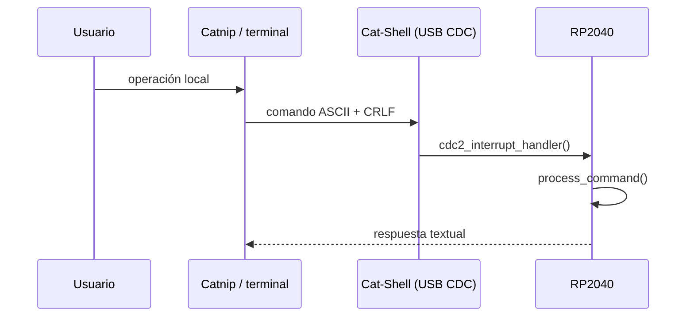
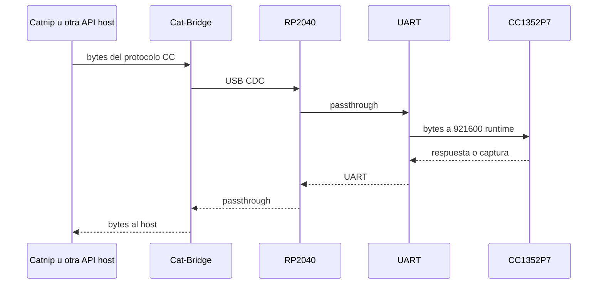
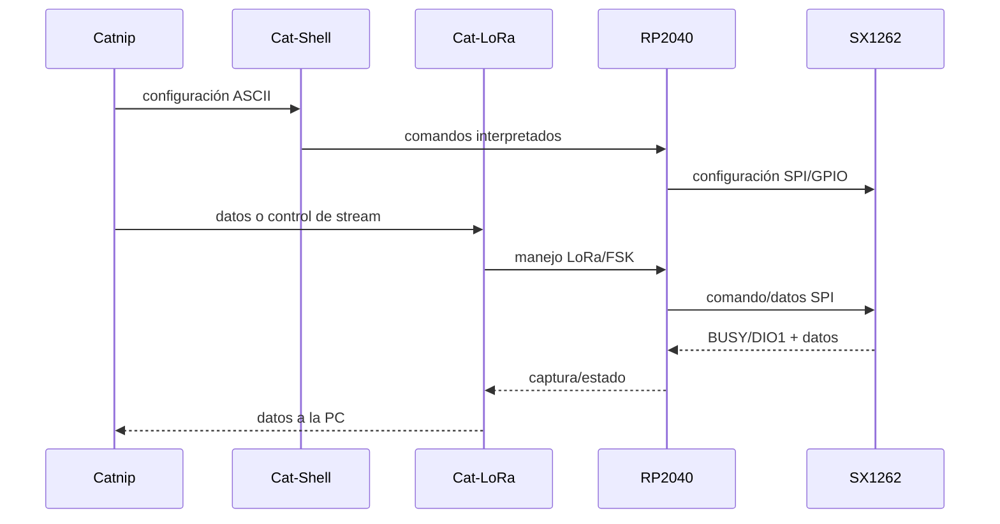
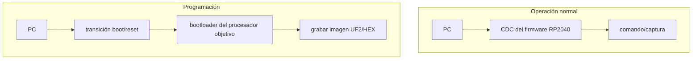

# Del PC a la radio — Rutas de extremo a extremo

## En una frase

Una operación CatSniffer no viaja por una ruta universal: el camino depende de si el destino es el RP2040, el CC1352P7 o el SX1262.

## Cómo leer una ruta

Para entender cualquier operación pregunta, en este orden:

1. ¿Qué programa de la PC la inicia?
2. ¿Qué interfaz CDC abre?
3. ¿Quién interpreta el mensaje?
4. ¿Qué bus o periférico se usa después?
5. ¿Cómo regresa la respuesta o captura?

**Host** es la PC que inicia la comunicación. **Target** es el procesador o dispositivo al que se dirige la operación.

## Ruta A — Control local del RP2040

Aquí RP2040 es el destino final. Ejemplos: identificación, modo, banda, reset/boot y configuración local relacionada con SX1262. Véase [[Firmware RP2040]] y [[Catnip CLI]].

## Ruta B — PC hacia CC1352P7

El RP2040 transporta; el firmware del CC interpreta. Con firmware oficial, el protocolo normal termina en una imagen binaria cuya implementación no está disponible. Con [[Arquitectura FeralRF|FeralRF]], la misma ruta transporta frames COBS+CRC interpretados por código fuente-visible en CC1352P7.

## Ruta C — PC hacia SX1262

La configuración y el flujo no están concentrados necesariamente en un solo CDC. RP2040 interpreta y convierte la intención host en llamadas al driver Zephyr/SX1262.

## Ruta D — Actualizar firmware no es usar el runtime

Un **bootloader** recibe una imagen y la escribe en flash. Para RP2040, BOOTSEL presenta un volumen `RPI-RP2`; para CC1352P7, Catnip controla BOOT/RESET por Shell y usa Bridge hacia el bootloader serie. [[Mapa de herramientas y comunicación PC]] conserva el detalle.

## La misma infraestructura, semánticas distintas

Cat-Bridge no define el protocolo de aplicación. Puede transportar:

- framing TI del sniffer oficial;
- comandos de bootloader durante flashing;
- protocolo COBS+CRC de FeralRF.

El intérprete downstream determina el significado.

## Concepciones erróneas comunes

- **“Catnip habla directamente con los radios.”** Habla con interfaces del RP2040; luego intervienen firmware, buses y procesadores.
- **“Todas las respuestas vuelven por el mismo puerto.”** Cada subsistema regresa por su CDC correspondiente.
- **“Si Cat-Bridge funciona, el RP2040 entiende el protocolo CC.”** Transportar bytes no implica interpretarlos.
- **“Flashing y runtime son el mismo protocolo.”** Usan estados, velocidades y receptores diferentes.

## Por qué esto importa después

Estas rutas son la plantilla para leer código y diseñar pruebas sin mezclar capas. También permiten comparar el sistema oficial con FeralRF sin afirmar que un cambio de protocolo CC altera la shell, el SX1262 o la enumeración USB.

## Evidencia

- [[Mapa de herramientas y comunicación PC]]
- [[Protocolos host-dispositivo]]
- [[Firmware RP2040]]
- [[Firmware CC1352P7]]
- [[Arquitectura FeralRF]]
- Registros: [[Fuentes herramientas PC]], [[Fuentes firmware oficial]], [[Fuentes FeralRF]]

## Comprueba tu comprensión

1. ¿En qué ruta RP2040 es un intérprete y en cuál es principalmente un puente?
2. ¿Por qué la ruta SX1262 puede usar Cat-Shell y Cat-LoRa en una sola operación conceptual?
3. ¿Qué cambia dentro de la ruta CC cuando se instala FeralRF?
4. ¿Por qué una respuesta ACK no siempre demuestra que ocurrió una transmisión RF?
5. ¿Qué procesador entra al bootloader en cada flujo de actualización?

**Anterior:** [[Catnip CLI]]  
**Siguiente:** [[Arquitectura FeralRF]]

