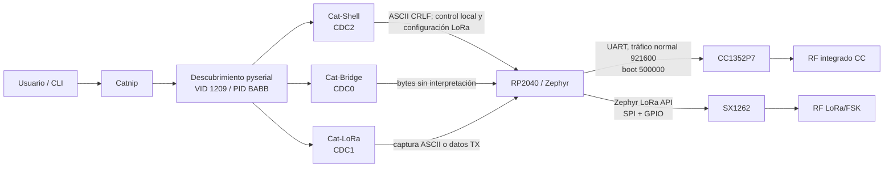
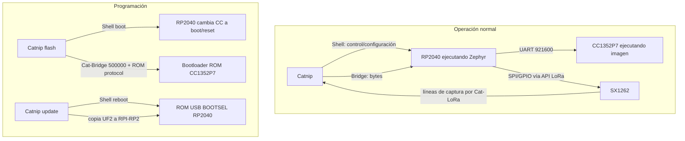

# Herramientas de la PC — Cómo llegan hasta CatSniffer

## En una frase

El software host descubre las interfaces serie de CatSniffer y convierte una intención del usuario en bytes que recorren la ruta apropiada hacia RP2040, CC1352P7 o SX1262.

## Modelo mental

**Host** significa aquí la PC. La herramienta principal, [[Catnip CLI|Catnip]], no controla transistores ni registros RF directamente: abre una interfaz ofrecida por [[RP2040 - El procesador de interfaz|RP2040]], envía un mensaje y espera una respuesta o captura. [[Del PC a la radio - Rutas de extremo a extremo]] ayuda a leer los flujos antes del inventario técnico de esta nota.

## 1. Objetivo y línea base

Esta nota conecta las herramientas oficiales de PC con la arquitectura de firmware ya validada. El análisis es estático: no se conectó ni se programó hardware.

- **CatSniffer-Tools:** rama `main`, commit `bc80979d7348bb038c3dd5d40be8aa51b90dd653` (2026-09-04).
- **CatSniffer-Firmware usado para contraste:** rama `v3.x`, commit `c0cd5a45e019dbd14ed11d039aacb13f300e5731`.
- **Plataforma:** CatSniffer v3.1 física, U8 observado como `CC1352P74`.
- **Conclusión:** Catnip es la herramienta de usuario principal. Usa los tres CDC del RP2040, pero no siempre de forma simétrica: configura SX1262 por Cat-Shell y recibe sus capturas por Cat-LoRa; usa Cat-Bridge como conducto hacia CC1352P7.

## 2. Inventario funcional

| Herramienta | Ruta | Estado y función | Entrada |
|---|---|---|---|
| Catnip | `CatSniffer-Tools/catnip/` | **Actual**. CLI Click, descubrimiento, captura, actualización y utilidades de protocolos. | `setup.py` registra `catnip=catnip:main_cli`; `catnip/catnip.py`; `modules/core/cli.py:main_cli()` |
| catsnifferTUI | `CatSniffer-Tools/catsnifferTUI/` | **Actual, independiente**, orientada a banco de pruebas, fabricación y depuración. Accede directamente a pyserial; no envuelve ni importa Catnip. | `catsnifferTUI/main.py:main()` |
| Legacy | `CatSniffer-Tools/Legacy/` | Histórico. No se hallaron imports desde Catnip actual. Conserva procedencia de utilidades antiguas. | Scripts diversos, sin entrada unificada actual |
| Cargador CC actual | `catnip/modules/firmware/cc2538.py` | Dependencia activa derivada de `cc2538-bsl`; no se importa desde `Legacy/cc2538-bsl/`. | `CCLoader` en `flasher.py` |
| Extcap BLE externo | paquete/comando `sniffle_extcap` | Dependencia externa activa para captura Sniffle/BLE; consume Cat-Bridge. | `modules/core/cli.py:run_extcap_directly()` |

`Legacy/` también contiene `cativity`, `catnip_uploader`, `catsniffer`, `pycatsniffer_bv3` y `sx1262Tools`, pero sus copias no son dependencias de ejecución de Catnip en esta línea base. Que el origen sea legado no implica que el módulo actual derivado sea inactivo.

## 3. Arquitectura de host

**Observado en código:** `usb_connection.py:find_devices()` enumera `serial.tools.list_ports.comports()`, filtra VID/PID y agrupa tres puertos. `RP2040/catsniffer/src/USB/usbd_init.c` y `RP2040/catsniffer/prj.conf` del firmware confirman el mismo VID/PID y tres CDC con etiquetas Cat-Bridge, Cat-LoRa y Cat-Shell.

## 4. Descubrimiento y asignación de puertos

Catnip filtra `VID=0x1209`, `PID=0xBABB`. Agrupa interfaces por, en orden: número de serie extraído de HWID, `serial_number` de pyserial o prefijo de ubicación USB. Después asigna roles por:

1. palabras `bridge`, `lora` o `shell` en descripción;
2. esas palabras en el atributo `interface`;
3. número de interfaz del HWID/ubicación (`0` → Bridge, `2` → LoRa, `4` → Shell);
4. orden lexicográfico de las rutas como último recurso.

Cada CDC USB consume una interfaz de comunicación y otra de datos, de ahí `0/2/4`. Solo se publica un dispositivo cuando hay al menos tres puertos y los tres roles quedaron resueltos. Varios equipos se numeran después de ordenar la clave de grupo; sin `-d`, la CLI toma el primero.

**Potencial problema que requiere evaluación posterior:** al descartar el grupo incompleto en `find_devices()`, los diagnósticos de “puerto faltante” de `get_device_or_exit()` normalmente no reciben dicho equipo. Si número de serie y ubicación no están disponibles, varios puertos pueden caer en el grupo `unknown`; el orden de nombres es un fallback frágil, especialmente en Windows.

## 5. Mapa definitivo de interfaces

| Interfaz visible | Abstracción Catnip | Interfaz firmware RP2040 | Destino | Propósito | Trama / intérprete |
|---|---|---|---|---|---|
| `Cat-Shell` | `ShellConnection` | CDC2, `cdc2_interrupt_handler()` → `process_command()` | RP2040; indirectamente SX1262 y líneas de boot/reset del CC | Identificación, versión, estado, modo, metadatos, configuración LoRa, boot/reboot | Texto ASCII terminado por `\r\n`; interpreta RP2040; respuesta textual hasta 150 ms de silencio |
| `Cat-Bridge` | `BridgeConnection`; `Catnip` hereda de ella | CDC0 ↔ UART CC | CC1352P7 | Sniffer TI, Sniffle/BLE, consola AirTag, bootloader serial CC | RP2040 hace passthrough de bytes. El consumidor de host o CC define la trama |
| `Cat-LoRa` | `LoRaConnection` | CDC1, `cdc1_interrupt_handler()` | Lógica RP2040 → SX1262 | Recepción/transmisión LoRa/FSK y comandos de modo comando | En streaming, líneas ASCII de recepción; bytes host→CDC1 son payload RF. En modo comando, comandos de texto interpretados por RP2040 |

No hay un único “protocolo CatSniffer”: cada CDC tiene transporte y propietario semántico distintos.

## 6. Operación normal frente a programación

El SX1262 no recibe una imagen de firmware del proyecto: se configura por comandos/registros desde RP2040.

## 7. Tres operaciones representativas

### A. Operación local RP2040: `catnip identify`

`modules/core/cli.py:identify()` → `send_identify_command()` → `get_device_or_exit()` → `ShellConnection.send_command("identify")` → bytes `identify\r\n` en Cat-Shell → firmware `cdc2_interrupt_handler()` → `process_command()` → `cmd_identify()` → texto `Identifying board...` y secuencia local de LED → respuesta leída hasta silencio y mostrada por Catnip.

La función identifica visualmente al equipo; no alcanza CC1352P7 ni SX1262.

### B. Operación CC1352P7: captura Zigbee/Thread

`modules/core/cli.py:sniff_zigbee()`/`sniff_thread()` → `modules/core/bridge.py:run_bridge()` → `protocol/sniffer_ti.py:SnifferTI` crea PING/STOP/configuración/START → Cat-Bridge → puente CDC0/UART transparente del RP2040 → límite de la imagen CC1352P7.

El retorno sigue CC → UART → RP2040 → Cat-Bridge → `SnifferTI.Packet` → PCAP → archivo, pipe y opcionalmente Wireshark. La trama observable comienza `@S`, incluye comando, longitud LE de dos bytes, datos y FCS, y termina `@E`. La implementación interna de la imagen normal del CC es binaria y **no está disponible en fuente** en el baseline de firmware; no se atribuye al RP2040 la semántica TI.

### C. Operación SX1262: captura LoRa

`modules/core/cli.py:sniff_lora()` → `modules/core/bridge.py:run_sx_bridge()` → `_configure_lora()` usa Cat-Shell para `lora_freq`, `lora_bw`, `lora_sf`, `lora_cr`, `lora_power`, `lora_syncword`, `lora_apply` y `lora_mode stream` → handlers RP2040 → API LoRa de Zephyr → SX1262.

En recepción, SX1262 → callback RP2040 `lora_rx_cb()` → línea `LORA RX: <hex> | RSSI: <n> | SNR: <n>` por Cat-LoRa → `protocol/sniffer_sx.py:SnifferSx.Packet` → PCAP linktype 148 / terminal / archivo / Wireshark.

**Requiere validación física:** que cualquiera de estas rutas reciba o transmita RF correctamente en la placa concreta.

## 8. Arquitectura de captura

| Ruta actual | Radio/procesador | Entrada al PC | Procesamiento host | Salida |
|---|---|---|---|---|
| Zigbee / Thread / 802.15.4 | RF integrado CC1352P7 | Cat-Bridge, trama TI binaria | `SnifferTI.Packet`; Cativity puede analizar 802.15.4 | PCAP (linktype predeterminado 147), log, pipe/Wireshark |
| BLE Sniffle | RF integrado CC1352P7 con imagen Sniffle | Cat-Bridge | proceso externo `sniffle_extcap` | FIFO/PCAP hacia Wireshark |
| AirTag scanner | CC1352P7 con imagen especializada | Cat-Bridge | terminal/PuTTY; Catnip no decodifica PCAP | texto |
| LoRa / FSK | SX1262 controlado por RP2040 | Cat-LoRa; configuración por Cat-Shell | `SnifferSx.Packet` | PCAP linktype 148, terminal/log/Wireshark |
| Meshtastic | SX1262 vía RP2040 | Cat-LoRa | módulos `protocols/meshtastic/` | decodificación, monitor o dashboard |

El firmware RP2040 solo imprime los primeros 40 bytes de una recepción LoRa/FSK y agrega `...`; el parser de host acepta esa marca. Por tanto, una captura de payload mayor queda truncada en este par de baselines.

## 9. Programación desde PC

### RP2040

`catnip update` llama `fw_update.check_and_update_rp2040()`: consulta `fw_version` por Cat-Shell, selecciona UF2 compatible, envía `reboot`; `cmd_reboot()` entra a ROM USB BOOTSEL. La herramienta espera el volumen `RPI-RP2` y `flash_rp2040_uf2()` copia el UF2 con `shutil.copy2`. Existe recuperación manual manteniendo BOOTSEL si los CDC no aparecen.

La copia exitosa se considera finalización; no se observó una comprobación obligatoria posterior de la versión ya arrancada.

### CC1352P7

`catnip flash` → `Flasher.flash_firmware()` → `CCLoader`: abre Cat-Bridge a 500000, ordena `boot` por Cat-Shell; RP2040 conmuta BOOT/RESET y su UART interna de 921600 normal a 500000. `modules/firmware/cc2538.py` sincroniza con el bootloader ROM, valida variante/tamaño, borra, escribe y verifica CRC del HEX. `exit` devuelve el RP2040 al modo normal/921600 y se actualizan metadatos por Cat-Shell.

`catnip restore` es una recuperación excepcional: carga Free-DAP en RP2040, usa OpenOCD/JTAG para recuperar CC y restaura después el firmware puente. No es la ruta runtime ni el flasheo normal.

## 10. TUI y legado

`catsnifferTUI` es una aplicación Textual reciente (`VERSION` 1.0.0) para pruebas, terminales y acciones de flota. `discovery.py`, `device.py` y `testbench.py` enumeran y abren los tres CDC directamente. Duplica parte de descubrimiento/comandos y no introduce una cuarta interfaz ni otro protocolo.

Su agrupación no es idéntica a Catnip: cuando no obtiene serie del HWID usa `port.location` completo, que puede variar por interfaz y separar un mismo equipo. Esto es un **potencial problema**, no una falla validada físicamente.

## 11. Compatibilidad de los baselines

| Relación | Clasificación | Evidencia/reserva |
|---|---|---|
| Hardware v3.1/P7 observado ↔ herramientas | Estructuralmente compatible; requiere hardware | El host reconoce la cadena de placa P7 de `fw_version`; no hubo prueba física |
| VID/PID y tres CDC | Estructuralmente compatible | `usb_connection.py` coincide con `usbd_init.c`/`prj.conf` |
| Etiquetas y números 0/2/4 | Estructuralmente compatible | Nombres y orden de interfaces coinciden |
| Shell CRLF y comandos usados | Estructuralmente compatible | `ShellConnection` ↔ `shell.c` |
| UART CC normal 921600 / boot 500000 | Estructuralmente compatible | `flasher.py`, `cc2538.py` ↔ `main.c`/shell mode |
| Trama TI ↔ imagen normal CC | Desconocida internamente | Host visible; imagen CC normal sin fuente |
| LoRa CLI principal | Estructuralmente compatible con limitación | Comandos y formato RX coinciden; payload RX se trunca a 40 bytes |
| `lora_extcap.py` | Contradicción de código | Llama `LoRaShellCommands.apply()`, inexistente; existe `apply_config()`. Además envía `0x00` periódico en modo stream, que el firmware trata como TX |
| IDs oficiales de firmware | Contradicción | Host declara `catnip_v3`; firmware declara `catsniffer_v3`. Host añade `justworks_scanner_cc1352p7`, ausente de la lista oficial firmware |

## 12. Límites y preguntas para Fase 4

- La compatibilidad física, enumeración en cada SO, RF y reconexión tras actualizar no fueron probadas.
- La semántica interna del sniffer TI normal termina en el límite binario del CC1352P7.
- No se ejecutó `lora_extcap.py`; sus incompatibilidades se deducen estáticamente.
- Antes de comparar FeralRF, puede asumirse la topología oficial aquí descrita, pero no que todas las capacidades estén físicamente validadas.
- No hay pregunta de usuario bloqueante antes del análisis estático de Fase 4. Sería útil conocer SO/Wireshark objetivo y si la evaluación posterior incluirá hardware.

## 13. Evidencia principal

- `CatSniffer-Tools/catnip/modules/core/usb_connection.py`
- `CatSniffer-Tools/catnip/modules/core/cli.py`
- `CatSniffer-Tools/catnip/modules/core/bridge.py`
- `CatSniffer-Tools/catnip/protocol/sniffer_ti.py`
- `CatSniffer-Tools/catnip/protocol/sniffer_sx.py`
- `CatSniffer-Tools/catnip/modules/firmware/{flasher.py,cc2538.py,fw_update.py,fw_metadata.py,fw_aliases.py}`
- `CatSniffer-Tools/catsnifferTUI/{discovery.py,device.py,testbench.py,main.py}`
- `CatSniffer-Firmware/RP2040/catsniffer/src/{main.c,shell_commands.c,fw_metadata.c}` y `RP2040/catsniffer/src/USB/usbd_init.c`

## Por qué esto importa después

Separar herramienta host, transporte y firmware evita adjudicar a Catnip comportamiento que ocurre dentro de la placa. También permite ver qué conserva FeralRF: usa otra API host y otro protocolo CC, pero sigue dependiendo del puente RP2040.

## Comprueba tu comprensión

1. ¿Qué hace Catnip antes de poder enviar una orden?
2. ¿Por qué capturar con CC1352P7 y capturar con SX1262 no usa exactamente la misma ruta?
3. ¿Cuál es la diferencia entre operación normal y programación?
4. ¿Dónde termina la evidencia fuente del sniffer oficial normal?

**Anterior:** [[Protocolos host-dispositivo]]  
**Siguiente:** [[Catnip CLI]]
