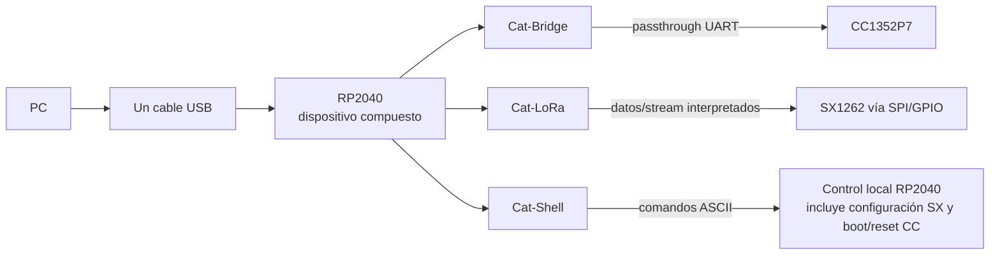

# USB CDC — Cómo CatSniffer aparece ante la PC

## En una frase

Un solo cable USB conecta la PC al RP2040, pero el firmware expone tres interfaces serie virtuales para separar destinos y responsabilidades.

## Modelo mental

USB permite que un dispositivo físico presente varias funciones lógicas. CatSniffer utiliza un **dispositivo USB compuesto** con tres instancias CDC ACM. El sistema operativo suele mostrarlas como tres puertos serie, aunque todas cruzan el mismo conector y terminan en el mismo RP2040.

Una **interfaz serie** es aquí un flujo ordenado de bytes. El nombre del puerto no define por sí solo el protocolo: cada CDC conduce esos bytes a una lógica diferente.

## Las tres rutas

| CDC | Quién interpreta normalmente | Destino o función | Formato principal |
|---|---|---|---|
| Cat-Bridge | CC1352P7 o su bootloader; RP transporta | CC1352P7 | bytes raw; framing depende de la imagen CC |
| Cat-LoRa | Firmware RP2040 | flujo/datos SX1262 | stream binario/textual según modo observado |
| Cat-Shell | Firmware RP2040 | control local y configuración | comandos ASCII terminados en CRLF |

## Qué significa “transparente” en Cat-Bridge

Transparente no significa que no haya firmware RP2040. Significa que, durante el tráfico normal, el RP2040 no necesita conocer la semántica de los bytes: copia USB→UART y UART→USB. Por eso el mismo conducto puede servir a la imagen oficial CC, a un bootloader o a [[Arquitectura FeralRF|FeralRF]], cada uno con protocolos distintos.

## Cómo Catnip encuentra las interfaces

[[Catnip CLI|Catnip]] enumera dispositivos USB/serie, usa VID/PID, número de interfaz, descripciones y número de serie para agrupar los tres CDC. No debe asumirse que el orden de nombres del sistema operativo sea siempre suficiente.

## Shell no significa lo mismo que CLI

- [[Catnip CLI|Catnip CLI]]: programa en la PC que interpreta lo escrito por el usuario.
- Cat-Shell: intérprete de comandos dentro del firmware RP2040.

Catnip puede enviar una orden por Cat-Shell, pero los dos intérpretes corren en lugares diferentes.

## Operación normal frente a programación

En runtime, las tres interfaces pertenecen al firmware RP2040 ya iniciado. Para actualizar RP2040, el chip entra en su bootloader ROM y aparece como `RPI-RP2`, fuera del modelo CDC normal. Para actualizar CC1352P7, Catnip usa Cat-Shell para la transición BOOT/RESET y Cat-Bridge hacia el bootloader serie del CC.

## Concepciones erróneas comunes

- **“Cada nombre corresponde a un conector.”** No: son interfaces del mismo USB.
- **“Todo lo que entra por USB lo interpreta RP2040.”** No: Cat-Bridge suele ser passthrough.
- **“Cat-LoRa configura por sí solo todo SX1262.”** La ruta oficial también usa comandos Cat-Shell para configuración.
- **“Baud rate USB es la velocidad física USB.”** En CDC es un parámetro de línea; importa especialmente cuando el RP configura la UART downstream.

## Por qué esto importa después

Elegir el CDC equivocado significa hablar con otro subsistema. También explica por qué FeralRF puede crear un protocolo nuevo sobre Cat-Bridge sin rediseñar USB y por qué programar firmware no debe confundirse con usarlo en runtime.

## Evidencia

- `RP2040/catsniffer/src/USB/usbd_init.c`, `boards/rpi_pico.overlay`, `src/main.c`.
- `CatSniffer-Tools/catnip/modules/core/usb_connection.py`.
- Síntesis detallada: [[Protocolos host-dispositivo]], [[Catnip CLI]], [[Mapa de herramientas y comunicación PC]].

## Comprueba tu comprensión

1. ¿Por qué aparecen tres puertos aunque exista un solo cable?
2. ¿Quién interpreta una orden enviada por Cat-Shell?
3. ¿Por qué Cat-Bridge puede servir tanto al runtime como al bootloader CC?
4. ¿Qué cambia en USB cuando RP2040 entra a BOOTSEL?
5. ¿Por qué agrupar interfaces por dispositivo es mejor que asumir su orden?

**Anterior:** [[Firmware CC1352P7]]  
**Siguiente:** [[Protocolos host-dispositivo]]

