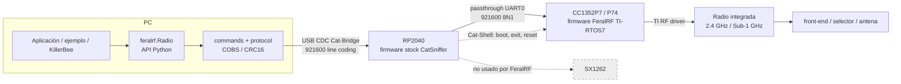
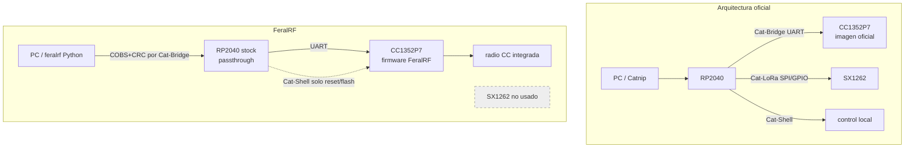

# FeralRF — Qué parte de CatSniffer reemplaza

## En una frase

FeralRF sustituye la aplicación del [[CC1352P7 - El procesador de radio programable|CC1352P7]] y añade una API Python propia, pero conserva el [[RP2040 - El procesador de interfaz|RP2040]], USB y Cat-Bridge de CatSniffer.

## Primero, recuerda la arquitectura oficial

En el sistema oficial, Cat-Bridge ya proporciona el camino `PC → USB → RP2040 → UART → CC1352P7`. FeralRF no inventa otro cable ni mueve USB al CC: cambia el programa que espera al final de ese camino. [[Del PC a la radio - Rutas de extremo a extremo]] muestra primero la ruta normal.

**Source-built firmware** significa que la aplicación puede construirse a partir de fuente disponible. Esto contrasta con la imagen oficial normal del CC, cuya implementación está disponible principalmente como HEX en el baseline estudiado.

## 1. Alcance y baseline

Análisis estático de `FeralRF/` rama `main`, commit `0178721cbd4f0d0f6f8eba5ae919ca46066d5dea` (2026-07-22), paquete Python `0.3.0`. El contenido fue verificado nuevamente el `2026-09-28` después de una ejecución interrumpida. No se compiló, ejecutó, flasheó ni conectó hardware.

El hardware de comparación es la CatSniffer v3.1 física del proyecto, con U8 observado como `CC1352P74`. La fuente histórica v3.1 aún nombra P1; esta discrepancia de procedencia no se elimina.

## 2. Respuesta arquitectónica

**Conclusión:** FeralRF es un firmware fuente-visible para el **CC1352P7** acompañado por una API Python propia. Reemplaza la imagen oficial/binaria de sniffer del CC1352P7, pero **no reemplaza el firmware RP2040**. Usa el RP2040 oficial como puente USB CDC↔UART y como auxiliar de reset/programación. No controla ni usa el SX1262.

| Pregunta | Respuesta basada en HEAD |
|---|---|
| ¿Dónde ejecuta el firmware FeralRF? | En el Cortex-M4F del CC1352P7/P74. |
| ¿Reemplaza firmware RP2040? | No. Requiere el puente stock/compatible. |
| ¿Reemplaza firmware CC1352? | Sí: sustituye el HEX oficial por `feralrf_cc1352.hex`. |
| ¿Usa SX1262? | No hay driver, comando ni API para él. Sidewalk LR se declara fuera de alcance. |
| ¿Qué CDC usa? | Cat-Bridge para runtime; Cat-Shell solo para reset/boot y flasheo externo. Cat-LoRa se omite. |
| ¿Quién termina USB? | RP2040. CC1352P7 solo ve UART0 921600 8N1. |
| ¿Usa Catnip? | Solo como programador externo documentado para el HEX; runtime usa `feralrf.Radio`. |
| ¿Protocolo propio? | Sí: binario COBS + CRC16-CCITT, distinto del protocolo TI de Catnip. |

## 3. Diagrama de arquitectura FeralRF



El protocolo FeralRF atraviesa el RP2040 sin interpretación. El endpoint semántico es el firmware del CC1352P7.

## 4. Inventario de componentes

| Área | Entorno | Papel actual |
|---|---|---|
| `firmware/cc1352/` | CC1352P/P7 | firmware embebido, CMake, linker, SysConfig y TI RF driver |
| `firmware/sdk/simplelink_cc13xx_cc26xx_sdk_8_30_01_01/` | build | submódulo TI SDK 8.30.01.01, commit `5b31d0a4903351e544546e23ef3330eaa4291ceb` |
| `python/feralrf/` | PC | transporte, codec, `Radio`, presets, emulación e integración KillerBee |
| `python/examples/` | PC + hardware | smoke/release-gate y flujos OTA |
| `python/tests/` | PC | pruebas Python unitarias/mock; no pruebas de firmware ni dispositivo real |
| `docs/` | documentación | arquitectura, protocolo, API, matriz declarada y runbooks |
| `hardware/` | referencia secundaria | copia KiCad/pinout con procedencia propia; no sustituye `CatSniffer:v3.1` |
| `docker/` | host build | Ubuntu/ARM GCC/Python; no incorpora las librerías completas del instalador TI |
| `.github/workflows/` | CI/release | Python test/lint; configuración de firmware best-effort; publicación Python |

## 5. Build, target y firmware ownership

`firmware/cc1352/CMakeLists.txt` define:

- target predeterminado `DEVICE_VARIANT=CC1352P7`;
- subfamilia `cc13x2x7_cc26x2x7` y `DeviceFamily_CC13X2X7`;
- linker `linker/cc1352p7.ld`;
- alternativa `CC1352P` con `cc13x2_cc26x2` y `linker/cc1352p.ld`;
- ARM GCC Cortex-M4F hard-float;
- `USE_TIRTOS=ON` por defecto;
- SDK 8.30.01.01 y librerías precompiladas RF/drivers/driverlib/SYSBIOS del instalador completo;
- artefactos `feralrf_cc1352.elf`, `.hex` y `.bin`.

**Conclusión de compatibilidad nominal:** el marcado físico `CC1352P74` pertenece al target P7 que selecciona el build predeterminado. El target genérico `CC1352P` es otra subfamilia y no debe usarse como sustituto implícito. La compatibilidad eléctrica/board-level completa aún requiere validación.

El README ordena flashear únicamente el `.hex` mediante Catnip; Catnip usa Cat-Shell para BOOT/RESET y Cat-Bridge para el bootloader ROM. FeralRF no implementa un actualizador propio ni carga el RP2040.

**Potencial efecto lateral del build:** durante configuración, CMake puede crear un symlink `source/ti/posix/include` dentro de `TI_SDK_PATH`. No se ejecutó CMake porque esa acción escribiría en el submódulo read-only.

## 6. Arranque y modelo de ejecución

El baseline predeterminado usa **TI-RTOS7/SYSBIOS**, no bare metal. El linker P7 entra por `_c_int00`; el runtime llega a `firmware/cc1352/src/main_rtos.c:main()`.

Secuencia observada:

1. `main()` habilita dominios, `Power_init()`, `GPIO_init()`, VIMS, constraints y LED.
2. Crea semáforos y dos tasks de igual prioridad 3, pila estática de 4096 bytes cada una.
3. Crea primero `RfTask_taskFxn()` y después `UartTask_taskFxn()`; `BIOS_start()` no retorna.
4. RF task inicializa crypto, abre un handle persistente 433 MHz y después ejecuta `DataTask_poll()` cooperativamente.
5. UART task inicializa UART/estado/protocolo y ejecuta `HostIFTask_poll()` cooperativamente.

**Contradicción documentación/código:** `docs/ARCHITECTURE.md:89` afirma que `RF_open` es lazy y no ocurre en boot. El baseline ejecutable observado contradice esa regla para 433 MHz: `src/main_rtos.c:153-169` abre y conserva `s_433_handle` al arrancar; los modos no-433 sí se abren al primer uso en `radio_if.c:1216-1226`. Para describir el runtime se sigue el código enlazado, no la regla documental general.

| Contexto | Funciones principales | Responsabilidad |
|---|---|---|
| UART task | `HostIF_init`, `HostIFTask_poll` | acumula COBS hasta `0x00`, limita lectura a 128 bytes/poll, encola un comando pendiente y vacía hasta 4 respuestas/poll |
| RF task | `DataTask_poll`, `HostIFTask_processPendingCommand` | ejecuta comandos, TX/RX, callbacks/colas RF y genera eventos |
| Callback TI RF | `RadioIF_rfCallback` | registra `RF_EventRxEntryDone`/overflow; procesamiento pesado queda en RF task |
| Output | `OutputIF_sendResponse`, `PacketQueue_*` | codifica respuesta y usa cola estática de 32 frames; una cola llena descarta y marca evento |

Hay un `src/main.c` NoRTOS y una ruta `USE_TIRTOS=OFF`, pero no son el baseline predeterminado. `startup/main_rtos.c` tampoco aparece en `ALL_SOURCES` del build actual. No deben mezclarse sus flujos con `src/main_rtos.c`.

## 7. Transporte y protocolo

`HostIF_init()` configura CC UART0 en DIO12 RX/DIO13 TX, 921600, 8N1, sin RTS/CTS. En el PC, `Radio` abre Cat-Bridge a 921600. RP2040 conserva el firmware oficial y pasa bytes CDC0↔UART.

Frame antes de COBS:

```text
CMD/RSP:1 | SEQ:1 | LEN_LE:2 | PAYLOAD:0..255 | CRC16_LE:2
```

Se codifica con COBS y se añade delimitador `00`. CRC16-CCITT usa polinomio `0x1021`, inicial `0xFFFF`. No existe fragmentación; el máximo pre-COBS es 261 bytes.

Respuestas síncronas conservan el `SEQ`; `RSP_RX_PACKET (0x90)` usa su propio contador. Errores RF asíncronos usan secuencia 0 (y el host acepta 0xFF por compatibilidad). El stream RX incluye timestamp, channel, RSSI, LQI, CRC, hasta 239 bytes de datos y metadata LL.

## 8. Arquitectura del driver RF

`radio_if.c` traduce estado de sesión a estructuras SmartRF/TI RF driver:

- `PhyManager` acepta BLE 1M/2M/Coded, IEEE 802.15.4, Sub-1 868/915 y proprietary GFSK.
- `RadioIF_setPhy`/`setPropConfig` ajustan comandos SmartRF, frecuencia, modulación y overrides.
- `RadioIF_startRx` selecciona backend BLE, IEEE o Sub-1 y postea comandos RX.
- `RadioIF_rfCallback` señala entradas completas/overflow; `RadioIF_poll` drena la data queue.
- `DataTask_emitRxPacket` transforma cada `RadioIF_RxPacket` en `RSP_RX_PACKET`.
- `RadioIF_transmitRaw` selecciona TX BLE advertising, IEEE o proprietary; usa `RF_postCmd` para `CMD_FS` en rutas críticas y `RF_runCmd`/comandos RF para TX.
- RX/TX comparten estado y se excluyen desde `ControlTask`.

El firmware no ofrece stacks completos Zigbee, Thread, Wi-SUN, W-MBus o Sidewalk. Expone PHY/paquetes/presets; parsing, MAC superior y seguridad de esos protocolos quedan fuera o en aplicaciones host.

## 9. Supuestos de hardware CatSniffer

| Supuesto FeralRF | Comparación v3.1/P7 | Clasificación |
|---|---|---|
| DIO12/DIO13 UART 921600 sin flow control | Coincide con PCB y firmware RP2040 validados | coincide estructuralmente |
| P7 build para U8 marcado P74 | Coincide con observación física | coincide nominalmente |
| RP2040 stock termina USB y puentea Cat-Bridge | Coincide con firmware oficial | coincide |
| DIO28/29/30 controlan paths 2.4/high-PA/Sub-1 | El PCB v3.1 y la propia copia `hardware/CatSniffer.kicad_pcb` conectan U2 `CTF1..3` a RP2040 GPIO8..10 | **contradicción/derivado de configuración LaunchPad** |
| FeralRF cambia bandas solo desde CC RF callback | `Radio` no envía comandos Shell `band1/2/3`; no coordina U2 del RP2040 | **ruta RF externa no establecida** |
| High PA por DIO29 | matriz FeralRF reconoce que no enruta y limita uso práctico a PA estándar | no compatible/pendiente |
| Reset por Shell = puerto Bridge+2 | Puede coincidir en una enumeración típica, pero Catnip usa descriptores; no es garantía de SO | supuesto frágil |

Los PASS OTA declarados sugieren que alguna condición de banco permitió rutas RF, pero la matriz no conserva estado `CTF1..3`, comandos de banda ni logs crudos. No se usa ese resultado para borrar la contradicción topológica.

## 10. Oficial frente a FeralRF

| Tema | CatSniffer oficial | FeralRF | Evidencia |
|---|---|---|---|
| USB-facing | RP2040 | RP2040 oficial reutilizado | firmware y `Radio.list_devices` |
| Firmware CC | sniffer normal binario | firmware FeralRF fuente-visible | `firmware/cc1352/src/` |
| Host runtime | Catnip/TI frames | paquete `feralrf`/COBS+CRC | `protocol.py`, `protocol.c` |
| Cat-Bridge | passthrough a imagen oficial | passthrough a FeralRF | ambos baselines |
| Cat-Shell | control local/config/flash | reset/boot y flasheo externo | `Radio.reset_device`, README |
| Cat-LoRa/SX1262 | RP2040 controla SX1262 | no usado | ausencia de implementación |
| Radio | CC + SX1262 según ruta | radio integrada CC únicamente | `radio_if.c` |
| Captura | TI/Sniffle o texto SX | eventos binarios propios | `RSP_RX_PACKET` |
| Dependencia binaria CC | sniffer HEX sin fuente | código app visible, pero librerías TI precompiladas | CMake/SDK |
| Programación | Catnip | reutiliza Catnip; no forma parte de API FeralRF | README |



## 11. Flujos representativos

### Información/control

`Radio.init()` → `RADIO_INIT` y `GET_INFO` → `build_frame()` → Cat-Bridge/RP passthrough/UART → `HostIFTask_poll()` → `CommandProcessor_processEncodedFrame()` → `ControlTask_onRadioInit()`/`ControlTask_getInfoPayload()` → `RSP_ACK`/`RSP_INFO` → `_read_response()` → `DeviceInfo`.

### Configuración

`Radio.set_phy()` → `CommandBuilder.set_phy()` → `CMD_SET_PHY` → `handle_command()` → `ControlTask_onSetPhy()` → `PhyManager_select()` + `RadioIF_setPhy()` → `ACK`. La selección lógica del CC no prueba que el selector RF U2 del RP esté en la ruta correcta.

### Recepción

`Radio.start_rx()` recibe ACK al programar evento → RF task `DataTask_poll()` → `RadioIF_startRx()` → `RF_open`/`RF_postCmd` y callback → cola RX → `DataTask_emitRxPacket()` → `RSP_RX_PACKET` asíncrono → `Radio.read_packets()` → `Packet`.

Si el backend falla después del ACK, firmware emite `RSP_ERROR` asíncrono; `read_packets()` lo expone como `RxStreamError`.

### Transmisión

`Radio.transmit()` → `CMD_TX_RAW` → `ControlTask_onTxRaw()` copia payload/agenda evento y envía ACK → RF task `ControlTask_processTxRaw()` → `RadioIF_transmitRaw()` → comando TI RF. El ACK confirma aceptación, no finalización RF. Un fallo posterior de TX_RAW genera `RSP_ERROR` asíncrono; burst/continuous limpian estado en fallo sin evento equivalente visible.

## 12. Incógnitas arquitectónicas para Fase 5

1. Estado real y control de U2/`CTF1..3` durante cada PHY/banda FeralRF.
2. Reproducibilidad de resultados de `VALIDATION_MATRIX.md` con el HEAD exacto y la placa v3.1/P74 actual.
3. Enumeración correcta de Cat-Bridge/Shell en Windows/Linux y con varios equipos.
4. Semántica práctica de ACK anticipado en TX/RX y entrega de errores asíncronos.
5. Cambios de PHY sin reset; la matriz declara fallo y exige reset entre cambios.
6. Saturación de colas: un comando pendiente, 32 frames de salida y drops bajo captura sostenida.
7. Impacto real de la contradicción entre el `RF_open` lazy documentado y la apertura 433 en boot implementada.

## 13. Evidencia principal

- `firmware/cc1352/CMakeLists.txt`, `linker/cc1352p7.ld`, `include/config.h`
- `firmware/cc1352/src/main_rtos.c`, `host_if*.c`, `command_processor.c`, `control_task.c`, `data_task.c`, `protocol.c`, `radio_if.c`, `crypto_engine.c`
- `firmware/cc1352/syscfg/ti_drivers_config.c`
- `python/feralrf/protocol.py`, `commands.py`, `enums.py`, `radio.py`, `presets.py`
- `README.md`, `docs/{ARCHITECTURE.md,protocol.md,VALIDATION_MATRIX.md}`
- baseline validado `CatSniffer:v3.1` y notas de Fases 1–3.

## Concepciones erróneas comunes

- **“FeralRF reemplaza el firmware completo de CatSniffer.”** Solo reemplaza la imagen CC1352P7.
- **“FeralRF reemplaza Catnip.”** Ofrece otra API host para su protocolo, pero sigue usando infraestructura de placa y Catnip continúa siendo el programador externo documentado.
- **“FeralRF habilita el SX1262.”** No usa SX1262 ni Cat-LoRa.
- **“Código fuente visible significa hardware validado.”** Visibilidad permite análisis; no demuestra comportamiento físico.

## Por qué FeralRF es importante

Vuelve inspeccionable la frontera que el firmware oficial normal deja binaria: parsing de comandos, estado, driver TI RF, RX/TX y eventos del CC1352P7. Eso permite estudiar y eventualmente modificar ese subsistema sin reescribir la interfaz USB RP2040.

## Comprueba tu comprensión

1. ¿Qué archivo/target cambia conceptualmente al instalar FeralRF?
2. ¿Qué dos funciones del RP2040 sigue necesitando FeralRF?
3. ¿Por qué la API Python FeralRF no implica que USB termine en CC1352P7?
4. ¿Qué ruta oficial queda completamente fuera de FeralRF?
5. ¿Por qué la selección externa U2/CTF sigue siendo una pregunta importante?

**Anterior:** [[Del PC a la radio - Rutas de extremo a extremo]]  
**Siguiente:** [[Protocolo y API Python]]  
**Comparación previa:** [[Mapa de firmware oficial]]
